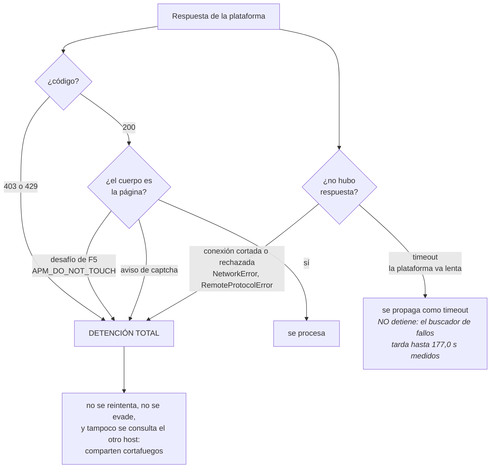

# Cumplimiento

Esta página existe porque el contexto regulatorio de esta herramienta cambió hace pocas
semanas y define varias decisiones de diseño. Todo lo que sigue está verificado contra fuente,
con la fecha de verificación indicada.

## Normas que este proyecto cita

Tabla única: cualquier otra página que nombre una de estas leyes se refiere a esta entrada, y
un test verifica que no se cite ninguna que no esté acá. La suite no consulta la red por
diseño, así que una cita legal no se puede comprobar en CI; lo que sí se puede exigir es que
traiga su fuente y la fecha en que alguien la miró.

| Norma | De qué trata | Dónde pesa acá |
|---|---|---|
| [Ley 21.719](https://www.bcn.cl/leychile/navegar?idNorma=1209272) | Protección de datos personales. Vigencia 1 de diciembre de 2026 | Por qué no se persiste nada de terceros y por qué las fixtures van anonimizadas |
| [Ley 20.886](https://www.bcn.cl/leychile/navegar?idNorma=1085055) | Tramitación electrónica | Su art. 9 inc. 3 es el que vuelve relevante la georreferencia de una actuación |
| [Ley 17.336](https://www.bcn.cl/leychile/navegar?idNorma=28933) | Propiedad intelectual | La licencia y el acuerdo de contribución se redactaron contra ella |
| [Ley 19.799](https://www.bcn.cl/leychile/navegar?idNorma=196640) | Documentos y firma electrónica | Aceptación del acuerdo de contribución |
| [Ley 2.977](https://www.bcn.cl/leychile/navegar?idNorma=23530) | Días feriados, de 1915 | Norma base del calendario de días inhábiles, que la hoja de ruta discute |

Verificado el 17 de agosto de 2026.

## El antecedente de julio de 2026

Entre el 25 y el 28 de julio de 2026, un abogado ingresó **38.477 escritos automatizados** a
tribunales civiles de todo el país mediante un agente externo, y la Oficina Judicial Virtual
colapsó. Los escritos correspondían mayoritariamente a desarchivos y renuncias de patrocinio y
poder.

Consecuencias, según la prensa nacional:

- La dirección **IP fue bloqueada** y se adoptaron medidas informáticas de emergencia.
- El Comité de Jueces Civiles de Santiago solicitó a la Corte Suprema **mantener restringido
  el acceso** del abogado a la plataforma.
- Se pidió un informe para evaluar **responsabilidades disciplinarias y penales**.
- Se propuso implementar **CAPTCHA** para impedir nuevos ingresos automatizados masivos.
- Se planteó **prohibir el uso de inteligencia artificial** para el ingreso de escritos.

Fuentes: [El Mostrador](https://www.elmostrador.cl/noticias/sin-editar/2026/07/28/el-dia-que-un-abogado-saturo-la-plataforma-del-poder-judicial-con-38-mil-escritos/),
[BioBioChile](https://www.biobiochile.cl/noticias/nacional/chile/2026/07/28/abogado-saturo-sistema-con-37-mil-escritos-en-horas-y-ahora-jueces-quieren-vetar-la-ia-en-tribunales.shtml),
[T13](https://www.t13.cl/amp/noticia/nacional/solicitan-prohibir-uso-ia-para-ingreso-escritos-plataforma-del-poder-judicial-28-7-2026).

### Qué se deduce de eso para este proyecto

La distinción entre **leer** e **ingresar** es la línea que separa esta herramienta de lo que
colapsó la plataforma. Por eso está declarada en el título, en la descripción del repositorio
y en la primera línea del README, no en la letra chica.

Tres decisiones bajan directamente de este antecedente:

1. **No existe código de escritura**, ni desactivado ni tras una bandera. Hay un job de CI que
   lo verifica mecánicamente en cada cambio.
2. **El intervalo mínimo no es configurable hacia abajo.** El daño de julio fue de volumen.
3. **Ante bloqueo, detención total.** No se evade, porque quien pagaría el costo de una
   escalada es el usuario que tiene plazos corriendo.

Qué cuenta como bloqueo, y qué no. Las dos clases de la rama derecha son clases BASE y no
casos sueltos: `NetworkError` cubre la conexión cortada al leer, al escribir y al establecerla,
y `RemoteProtocolError` cubre que algo se interponga y hable mal HTTP. La rama de la derecha existe porque un rechazo del
cortafuegos no siempre llega como código de error: puede cortar la conexión, o mandar un
desafío con HTTP 200. Las tres detienen el proceso entero, no la llamada que se topó con ellas.

## Condiciones de uso de la plataforma

El Acta 37-2016 de la Corte Suprema, artículo 3, obliga a aceptar los términos y condiciones
de la Oficina Judicial Virtual para usarla.

Leídas en `oficinajudicialvirtual.pjud.cl/home/condicionesdeuso.php` el 16 de agosto de 2026:

**No contienen ninguna cláusula** sobre automatización, robots, scraping, extracción masiva,
minería de datos ni acceso programático.

La cláusula operativa es la **CUARTA**:

> Los usuarios no deben utilizar el servicio de formas que "dañar, inutilizar, **sobrecargar**,
> deteriorar el Portal o impedir su normal utilización".

Lo que el contrato prohíbe es la **sobrecarga**, que es una propiedad del régimen y no de
dos peticiones sueltas: al portal le importa cuántas recibe, no cómo se reparten dentro de un
minuto. De ahí que el ritmo sostenido de una consulta cada 5 segundos, con ráfaga acotada a
4, sea el
control jurídicamente cargante del proyecto y no una cortesía: es esa cláusula implementada en
código.

## robots.txt

Verificado el 16 de agosto de 2026:

| Host | Contenido |
|---|---|
| `oficinajudicialvirtual.pjud.cl/robots.txt` | `User-agent: *` → `Disallow: /` |
| `juris.pjud.cl/robots.txt` | `Disallow: /` para todos, **más bloqueo nominal de `Anthropic-ai` y `Claude-Web`** |
| `www.pjud.cl/robots.txt` | 404, no publica |

Esto se dice completo y sin adornos porque es información que quien evalúe usar la herramienta
merece tener.

Consecuencias asumidas:

- La consulta de causas se hace por el enlace que **la propia institución publica en la
  portada de `www.pjud.cl`** como acceso público, en un host que no publica robots.txt.
- **La jurisprudencia sí está implementada, y la decisión fue consciente.** Queda escrito acá
  para que no se lea como un descuido.

### Sobre incluir jurisprudencia pese al rechazo nominal

`juris.pjud.cl` bloquea con comodín y **además nombra a `Anthropic-ai` y `Claude-Web`**.
Re-verificado el 17 de agosto de 2026: el archivo sigue igual.

El proyecto empezó dejando ese host fuera de alcance por esa razón. El titular del proyecto
revisó el hallazgo y decidió incluirlo de todos modos. Es su decisión y está tomada; no se
re-discute cada vez que alguien lee esta página. Lo que corresponde es dejar constancia de qué
se sabía al tomarla:

| | |
|---|---|
| El bloqueo comodín | Aplica igual que en la Oficina Judicial Virtual, cuyo alcance ya estaba asumido |
| El bloqueo nominal | Nombra rastreadores de IA. Este cliente se identifica como `mcp-pjud`, no como ninguno de ellos, y **eso no lo exime**: el comodín ya lo cubre |
| Diferencia de fondo | En la Oficina Judicial Virtual el rechazo es genérico; acá hay una manifestación específica contra agentes de esta clase |
| Lo que no cambia | Ritmo, identificación, detención total, solo lectura y no persistencia rigen igual en los dos hosts |

Lo que **no** se hace, y sigue sin hacerse: no se rota IP, no se suplanta un navegador, no se
resuelve ni se evade la verificación, y no se usan credenciales del Poder Judicial para ver más
sentencias de las que ve cualquiera.

Sobre esa verificación, para que quede medido y no inferido: el buscador ejecuta un reCAPTCHA
v3 al cargar la página y valida el token contra su propia ruta. **La búsqueda no depende de
ese token**: una sesión anónima sin captcha recibe resultados reales. No se tocó nada para
lograrlo. Si algún día empieza a exigirlo, la respuesta es detenerse, no resolverlo.

## Ley 21.719 sobre protección de datos personales

Publicada el **13 de diciembre de 2024**. Entra en vigencia el **1 de diciembre de 2026**.

Crea la Agencia de Protección de Datos Personales, con potestad para investigar de oficio,
sancionar, ordenar la suspensión de tratamientos y publicar un Registro Nacional de Sanciones.
Multas de hasta **20.000 UTM**, o **4% de los ingresos anuales** en caso de reincidencia.

### Por qué te afecta

Los datos que devuelve esta herramienta (nombres, RUT, roles, actuaciones) son **datos
personales de terceros**. Que provengan de una fuente pública no los saca del ámbito de la ley.

**El software no persiste nada**: consulta y devuelve. Esa decisión es de diseño y es la razón
por la que el uso base no genera obligaciones de tratamiento.

**Si tú decides almacenar los resultados**, el responsable del tratamiento pasas a ser tú, con
todo lo que implica:

- Base de licitud para el tratamiento
- Principio de finalidad y de minimización
- Plazos de conservación definidos
- Derechos ARCO del titular (acceso, rectificación, cancelación, oposición)
- Notificación de brechas dentro de **72 horas**

Faltan menos de cuatro meses para que rija. Si vas a guardar datos, asesórate antes.

## Alineación con el Poder Judicial

El Tribunal Pleno de la Corte Suprema aprobó el **Plan Estratégico 2026-2030** mediante
**Acta N.° 151-2026**. La definición de una **Política Institucional de Inteligencia
Artificial** es una de las iniciativas priorizadas para 2026.

**Esa política todavía no se publica.** Cuando se publique, este proyecto se revisará contra
ella, y si algo queda fuera de lo que la institución defina, se ajusta o se retira. Esa
posición está escrita acá de antemano a propósito, para que no sea una decisión que se tome
bajo presión.

Mientras tanto, los criterios que se aplican son los que se pueden verificar hoy: las
condiciones de uso, el antecedente de julio, y la lógica de no hacer nada que la institución
haya señalado que no quiere.

### Vía institucional

El camino correcto para convertir esto en algo formalmente respaldado es solicitar acceso
sancionado a la **Corporación Administrativa del Poder Judicial**. Una herramienta de solo
lectura, identificada, con límite de ritmo y sin capacidad de escritura es plausiblemente el
tipo de cosa que una política de IA institucional podría contemplar.

## Marca

Sin logos institucionales. Sin la tipografía ni los colores del Poder Judicial. Sin usar
"Poder Judicial" en el nombre del paquete. La salida de esta herramienta no debe presentarse
como información oficial.

## Divulgación responsable

Si al usar esto detectas una debilidad en la plataforma del Poder Judicial, **no la publiques
ni la reportes en este repositorio**. Va directo a la Corporación Administrativa.

Esa regla se aplicó durante el desarrollo: hay hallazgos sobre el comportamiento de la
plataforma que quedaron deliberadamente fuera de este repositorio por esta razón.

## Resumen de controles

| Control | Dónde vive | Verificado por |
|---|---|---|
| Sin código de escritura | Todo el proyecto | Job de CI que busca endpoints de ingreso |
| Intervalo mínimo 5 s | `client.py` | Test unitario + job de CI |
| Detención ante 403/429 | `client.py` | Test unitario, sin reintento |
| Fallo ruidoso | `parser.py` | Tres tests de estructura |
| User agent identificable | `client.py` | Obligatorio por variable de entorno |
| Sin persistencia | Todo el proyecto | No hay dependencia de base de datos |
| Bitácora de peticiones | `client.py` | Test unitario |

## Hallazgos de OpenSSF Scorecard que siguen abiertos

Se dejan anotados con su razón, para no re-discutirlos cada vez que aparecen.

| Hallazgo | Estado | Por qué |
|---|---|---|
| `Maintained` | Se resuelve solo | Mide actividad sostenida en 90 días. El repositorio es nuevo |
| `Code-Review` | Se resuelve al usar pull requests | Mide cambios revisados. Hasta ahora los commits fueron directos a `main` |
| `SAST` | Resuelto | Se pasó de modo gestionado a un workflow propio con `codeql-action` fijado por SHA, que es la huella que Scorecard busca. **`security-extended` no es parte de eso**: agrega consultas, no cierra el hallazgo, y el propio workflow lo dice |
| `Fuzzing` | Resuelto | Harness de Atheris en `tests/fuzz_parser.py`. Ver abajo por qué también hay pruebas de propiedades |
| `CII-Best-Practices` | **Inalcanzable con esta licencia** | Ver abajo |

Sobre `Code-Review`: en un proyecto de una persona no tiene arreglo técnico, pero para código
que decide plazos procesales vale preguntarse si conviene un segundo par de ojos antes de
tocar el parser. Queda dicho como pregunta abierta y no como casilla marcada.

### Sobre `Fuzzing`

La primera versión de esta nota decía que Scorecard "no reconoce" las pruebas basadas en
propiedades. Es incorrecto, y conviene decirlo bien porque cambia la conclusión.

Scorecard acepta tres señales: inclusión en [OSS-Fuzz](https://google.github.io/oss-fuzz/),
despliegue de ClusterFuzzLite, o funciones de fuzzing definidas por el proyecto. Y en esa
tercera categoría **sí cuenta explícitamente las librerías de pruebas basadas en propiedades**:
QuickCheck, Hedgehog, SmallCheck y validity en Haskell, fast-check en JavaScript y TypeScript,
proper y quickcheck en Erlang, FsCheck en C# y F#, PropCheck y ExUnitProperties en Elixir, y
qcheck en Gleam.

O sea el enfoque que este proyecto usa es exactamente el que Scorecard considera válido. Lo
que falta es que su detector incluya **Hypothesis**, que es el equivalente en Python y no está
en esa lista.

De modo que el hallazgo no dice "a este proyecto le falta fuzzing". Dice "Scorecard todavía no
sabe detectar el fuzzing que este proyecto tiene".

Y hay un detalle que la primera versión de esta nota tampoco tenía: **Scorecard detecta
Atheris con un grep**. Su código (`checks/raw/fuzzing.go`) busca el patrón `import atheris` en
archivos `*.py`, sin exigir inscripción en OSS-Fuzz ni infraestructura alguna. Inscribirse en
OSS-Fuzz son semanas de trámite; un archivo con ese import son minutos. La nota anterior
mandaba por el camino largo.

El repositorio tiene ahora `tests/fuzz_parser.py`, un harness real que corre el parser y
verifica la misma invariante. No corre en CI porque el fuzzing por tiempo no encaja en un
check obligatorio; se ejecuta a mano al tocar el parser.

Conviene precisar en qué se diferencian, porque no es en el oráculo. Un harness de Atheris que
ejecute el parser y afirme que toda fecha devuelta viene en la entrada detecta la misma
infracción que `test_nunca_inventa_una_fecha`: los fuzzers no están limitados a encontrar
corrupción de memoria, y cualquier harness puede llevar el oráculo que se le ponga.

La diferencia real está en cómo se llega a la entrada que rompe. Hypothesis genera desde
estrategias tipadas, así que produce fechas y horas bien formadas y explora el espacio que le
interesa a este parser, y cuando falla **reduce** el caso hasta el ejemplo mínimo. Un fuzzer
guiado por cobertura muta bytes, lo que le permite alcanzar caminos que una estrategia tipada
quizá nunca genere, a cambio de entregar entradas menos legibles.

Son complementarios, y por eso están los dos. La generación estructurada de Hypothesis corre en
cada cambio y rinde más por hora invertida; el harness de Atheris se usa cuando se toca el
parser. La inscripción en OSS-Fuzz, que automatizaría el segundo de forma continua, queda como
paso posterior y no como requisito.

### Sobre `CII-Best-Practices`

La insignia de OpenSSF Best Practices **no se puede obtener con la licencia de este proyecto**,
y conviene dejarlo escrito para no volver a intentarlo.

Entre los criterios obligatorios del nivel `passing` está `floss_license`:

> "The software produced by the project MUST be released as FLOSS"

[PolyForm Strict](licencia.md) no es FLOSS: prohíbe modificar, distribuir y el uso comercial.
No es un criterio sugerido que se pueda saltar, es un MUST.

Marcarlo como cumplido sería falso, y una insignia es una declaración pública. Así que el
hallazgo queda abierto de forma permanente mientras la licencia no cambie.

Es el de severidad más baja de los cinco, y la decisión de licencia se tomó por razones que
pesan más: que nadie publique su propia versión y que todo uso profesional pase por un permiso
explícito. El costo está anotado en la página de licencia junto a los demás.

La serie Baseline de la misma insignia podría no exigir FLOSS, pero sus niveles
(`baseline-1/2/3`) no son los que el check de Scorecard puntúa, que son `passing`, `silver` y
`gold`. O sea tampoco cerraría el hallazgo.
