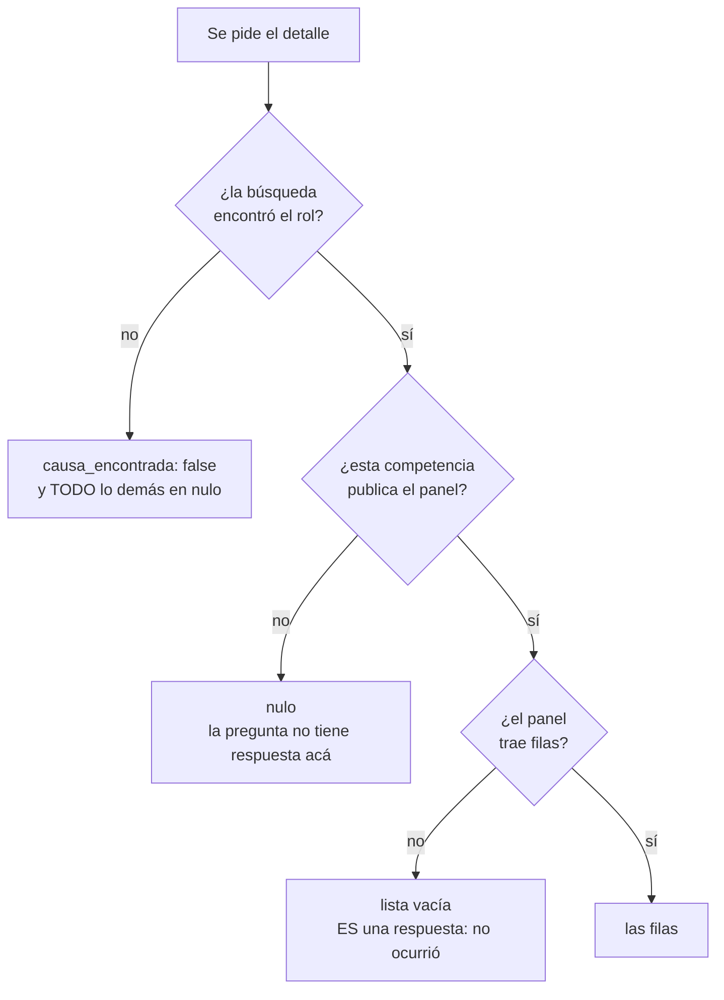

---
myst:
  html_meta:
    description: "Referencia de las 14 herramientas MCP, sus parámetros y cada campo que devuelven, más las plantillas que se invocan desde el cliente."
---

# Referencia de herramientas

Las 14 están anotadas en el protocolo como `readOnlyHint: true` y `destructiveHint: false`.

:::{note}
Las anotaciones MCP son **pistas**, no garantías verificables por el cliente. La garantía real
de que este servidor no escribe es que **el código de escritura no existe**, y hay un job de
CI que lo comprueba en cada cambio.
:::

Todo lo de esta página se compara contra `tests/contrato.json`, que guarda el catálogo entero
como viaja, con su orden, más la directiva. Un cambio de lo que el servidor promete falla hasta
que alguien lo apruebe con `APROBAR_CONTRATO=1 uv run pytest tests/test_contrato.py`.

## Directiva operativa

El servidor expone una directiva por el campo `instructions` del protocolo. Cualquier cliente
que se conecte la recibe **antes** de poder llamar una herramienta, así que la distinción
entre las dos fechas llega antes que cualquier resultado:

> Al informar fechas de actuaciones de receptor, distinguir siempre:
>
> - `fecha_diligencia`: cuándo el ministro de fe practicó la diligencia. **Es la que corre los
>   plazos procesales.**
> - `fecha_registro`: cuándo se registró en el sistema. **No** corre plazos.
>
> Suelen diferir en varios días. [...] Una búsqueda que no encuentra no prueba que algo no
> exista. Las causas reservadas no aparecen en la consulta pública.

La directiva cabe en **2.048 bytes**, que es donde el cliente la corta sin avisar. Las reglas
que no caben viven en la herramienta que las necesita:

| regla | dónde está |
|---|---|
| qué buscadores traen `ocultas` con número, y la medición del índice | `buscar_jurisprudencia` |
| con qué acotar cada competencia | las tres búsquedas de nombre, RUT y fecha |
| qué significa `georreferenciado` en falso, entero | `obtener_actuaciones_receptor` |
| cuándo caduca una referencia de documento y qué hacer con un escaneo | `obtener_documento` |

Por qué se repartieron así se explica en [Cómo se usa e interpreta](uso.md).

:::{note} Qué revisión del protocolo habla este servidor
**Depende del transporte, y conviene decir las dos.** El SDK instalado conoce hasta
**2026-07-28**, la revisión sin estado donde los servidores publican lo suyo por
`server/discover`. Por ahí se habla cuando el cliente vive en el mismo proceso.

Todos los clientes que esta guía documenta lo levantan como **proceso aparte por stdio**, y ahí
el saludo llega hasta **2025-11-25**: es lo que negocia Claude Desktop, Claude Code, Cursor, VS
Code y Codex. Medido pidiendo `2026-07-28` en el saludo y viendo qué contesta. En esa ruta
`server/discover` no se alcanza, así que quien lo intente recibe método desconocido.

Los dos números salen del SDK y no de la memoria: `tests/test_documentacion.py` los compara
contra `LATEST_PROTOCOL_VERSION` y `LATEST_HANDSHAKE_VERSION`, así que actualizar la dependencia
y no esta página deja la suite en rojo.

Por el carril de 2026-07-28 los catálogos viajan con una pista de frescura: `tools/list`,
`prompts/list`, `resources/list`, `resources/templates/list` y `server/discover` salen con
`ttlMs: 3600000` y `cacheScope: public`, porque cambian una vez por versión. `resources/read`
también admite pista y no la lleva a propósito: leer un documento vuelve a pedírselo al Poder
Judicial, y una copia guardada de un documento de un tercero es lo que prohíbe la regla 5. Por
el saludo de 2025-11-25 ese campo no existe y el SDK lo criba: ahí el catálogo llega sin pista.
:::

El servidor se presenta con un icono propio, una balanza dibujada en SVG que viaja como `data:`
URI dentro del saludo. No hay una dirección que el cliente tenga que ir a buscar, ni un host
ajeno que se entere de quién lo abrió.

## `listar_cortes`

Las Cortes de Apelaciones con el **código** que las búsquedas exigen. Sin parámetros.

Llamarla antes de buscar por nombre, RUT o fecha en `apelaciones`: ahí `corte` es obligatorio y
su valor no aparece en ninguna otra respuesta.

| Campo | Tipo | Qué es |
|---|---|---|
| `codigo` | int | Lo que va en el parámetro `corte` de las búsquedas |
| `nombre` | str | Nombre tal como lo publica la plataforma |

Medido el 20 de agosto de 2026: **17 cortes**.

### Cómo bajar a la causa apelada

El detalle de una causa de la Corte Suprema trae `causa_de_origen` con la corte por su
**nombre**, y la búsqueda pide el **código**. Son dos llamadas:

1. `listar_cortes` para resolver el nombre a código.
2. `buscar_causa_por_rit` en `apelaciones` con ese `corte`, el `rol` y el `anio` de la causa de
   origen, y el `libro` en `tipo`: ahí el número de rol solo no identifica una causa.

```{include} _generado/listar_cortes.md
```

## `listar_tribunales`

Los tribunales de una corte, con el **código** que las búsquedas exigen.

:::{important} Es el muro de entrada
Para buscar en primera instancia hay que pasar `tribunal`, y ese número no aparece en ninguna
otra respuesta ni en esta página. Sin esta herramienta hay que sabérselo de memoria.
:::

| Parámetro | Qué es |
|---|---|
| `corte` | **Obligatorio.** Código de la corte, el que entrega `listar_cortes` |
| `competencia` | Sólo las que se acotan por tribunal. Los códigos difieren entre competencias |

`corte` no tiene valor por defecto a propósito: con uno, una consulta destinada a otra
jurisdicción devolvería en silencio los tribunales de Concepción, que es una lista plausible y
equivocada.

Suprema y apelaciones no se ofrecen, y está medido por qué: suprema devuelve `null` porque
**es** la corte y no tiene tribunales debajo, y apelaciones devuelve 118 juzgados de primera
instancia, que no son con qué se busca ahí.

| Campo | Tipo | Qué es |
|---|---|---|
| `codigo` | int | Lo que va en el parámetro `tribunal` de las búsquedas |
| `nombre` | str | Nombre tal como lo publica la plataforma |

### Cómo seguir un exhorto

El detalle entrega el tribunal de destino por su **nombre**, y la búsqueda pide el **código**.
Son tres llamadas:

1. `listar_cortes` para ubicar la corte del tribunal de destino.
2. `listar_tribunales` con esa corte, para sacar el código por nombre.
3. `buscar_causa_por_rit` con el `rol_destino` del exhorto y ese `tribunal`.

```{include} _generado/listar_tribunales.md
```

## `buscar_causa_por_rit`

Busca causas por rol en la consulta pública.

| Parámetro | Tipo | Descripción |
|---|---|---|
| `tipo` | str | Letra del rol. En civil: `C`, `V`, `E`, `A`, `F` o `I`. En apelaciones y penal va el libro, y en suprema va VACÍO |
| `rol` | int | Número, sin la letra ni el año |
| `anio` | int | Año, cuatro dígitos |
| `competencia` | str | Verificadas: `civil`, `laboral`, `cobranza`, `penal`, `suprema`, `apelaciones` |
| `tribunal` | int, opcional | Código del tribunal. Omitir para buscar en todos |
| `corte` | int, opcional | **Omitir salvo certeza** |
| `paginas` | int | Cuántas páginas recorrer como máximo. Al excederlo levanta excepción en vez de recortar |

:::{warning}
`corte` no tiene valor por defecto a propósito. Fijarla produce **falsos negativos**: en una
prueba real, una búsqueda con la corte puesta en Concepción omitió una causa del 11º Juzgado
Civil de Santiago que sí existía.
:::

Devuelve una lista de causas con `rol`, `fecha_ingreso`, `caratulado`, `tribunal` y una
`referencia` opaca que declara durar 30 minutos.

```{include} _generado/buscar_causa_por_rit.md
```

:::{note} Con qué hay que acotar la búsqueda
Las tres búsquedas de abajo (nombre, RUT y fecha) exigen acotar, y **con qué depende de la
competencia**. Está medido una por una contra el sistema real:

```{include} _generado/acotacion.md
```

En apelaciones la plataforma responde *"Por favor seleccione una Corte para la búsqueda"* y no
entrega resultados. En suprema las tres andan sin corte ni tribunal.
:::

## `buscar_causa_por_nombre`

Busca causas por nombre de litigante.

Reglas de la plataforma, medidas probando cada combinación contra el sistema real:

- Exige **al menos dos de los tres campos de nombre** (nombre, apellido paterno, apellido
  materno). El **año no cuenta** para ese mínimo: `paterno + año` es rechazado, `paterno +
  materno` es aceptado.
- Exige **acotar la búsqueda** según la competencia (ver el cuadro de arriba). Donde el
  tribunal es obligatorio eso limita la utilidad de la herramienta: hay que saber dónde está
  la causa antes de poder buscarla.

| Parámetro | Tipo | Descripción |
|---|---|---|
| `apellido_paterno` | str | Apellido paterno del litigante |
| `apellido_materno` | str | Apellido materno |
| `nombre` | str | Nombres |
| `anio` | int, opcional | Año de ingreso. **No cuenta** para el mínimo de dos campos |
| `competencia` | str | Verificadas: `civil`, `laboral`, `cobranza`, `penal`, `suprema`, `apelaciones` |
| `tribunal` | int | Obligatorio salvo en `suprema` y `apelaciones` |
| `corte` | int | Obligatorio en `apelaciones`. En el resto, **omitir salvo certeza** |
| `paginas` | int | Tope de páginas a recorrer |

```{include} _generado/buscar_causa_por_nombre.md
```

## `buscar_causa_por_rut_juridica`

Busca causas de una persona jurídica por su RUT. Es la **única vía para empresas**, que no
tienen Clave Única y por lo tanto no aparecen en "Mis Causas".

Exige el dígito verificador, y acotar según la competencia (ver el cuadro de arriba).

| Parámetro | Tipo | Descripción |
|---|---|---|
| `rut` | int | RUT sin dígito verificador ni puntos |
| `digito_verificador` | str | Dígito verificador: 0-9 o K |
| `anio` | int, opcional | Año de ingreso |
| `competencia` | str | Verificadas: `civil`, `laboral`, `cobranza`, `penal`, `suprema`, `apelaciones` |
| `tribunal` | int | Obligatorio salvo en `suprema` y `apelaciones` |
| `corte` | int | Obligatorio en `apelaciones`. En el resto, **omitir salvo certeza** |
| `paginas` | int | Tope de páginas a recorrer |

```{include} _generado/buscar_causa_por_rut_juridica.md
```

## `buscar_causa_por_fecha`

Causas ingresadas en un rango de fechas.

| Parámetro | Tipo | Descripción |
|---|---|---|
| `desde` | str | Fecha inicial, DD/MM/AAAA |
| `hasta` | str | Fecha final, DD/MM/AAAA |
| `tribunal` | int | Obligatorio salvo en `suprema` y `apelaciones` |
| `competencia` | str | Verificadas: `civil`, `laboral`, `cobranza`, `penal`, `suprema`, `apelaciones` |
| `corte` | int | Obligatorio en `apelaciones`. En el resto, **omitir salvo certeza** |
| `paginas` | int | Tope de páginas a recorrer |

Es la cuarta búsqueda que la plataforma ofrece y responde una pregunta que las otras tres no:
qué ingresó contra alguien en un período, sabiendo el tribunal pero no el rol.

Un solo día en un solo tribunal puede devolver decenas de causas, así que conviene acotar el
rango antes de subir el tope de páginas: cada página son 100 resultados y una petición.

## `obtener_actuaciones_receptor`

Actuaciones del ministro de fe con su fecha real de diligencia. Es la razón de existir del
proyecto.

:::{warning}
Sólo **civil** entrega actuaciones por esta vía. En **cobranza** las diligencias del ministro de
fe viven en un panel propio (`diligenciaCob`), que `obtener_detalle_causa` lee y entrega en
`diligencias`, así que la llamada por esta vía se **rechaza**.

Su Historia sí nombra algunas, y por eso el rechazo: tres filas dicen `Actuacion - Receptor` y
ninguna trae fecha de diligencia, o sea leerlas de ahí daría una lista **parcial y sin el dato
que se busca**. Si son todas o sólo una parte no está medido, y entregarlas sería
informar una completitud desconocida como si fuera el total.

El panel tampoco publica la fecha en que se practicó la diligencia, así que sus filas **no son
actuaciones** y no se pueden presentar como tales: dicen qué diligencia hay, en qué estado y
quién figura a cargo.

En laboral, penal, apelaciones y suprema no existen: en todo el sitio sólo hay
`receptorCivil` y `receptorCobranza`.
:::

Toma `tipo`, `rol`, `anio`, `competencia`, `tribunal` y `corte`, con el mismo significado que
en `buscar_causa_por_rit`. No toma `paginas`: de la búsqueda sólo usa la primera causa.

Internamente encadena búsqueda, detalle y un pase por cada cuaderno, porque la plataforma no
direcciona el detalle por rol. Son varias peticiones bajo el intervalo mínimo, así que tarda.

### Campos de la respuesta

| Campo | Tipo | Descripción |
|---|---|---|
| `folio` | str | Número de folio |
| `etapa` | str | Etapa procesal |
| `tramite` | str | Siempre `Actuación Receptor` |
| `desc_tramite` | str | Texto literal, sin normalizar |
| `fecha_diligencia` | date \| null | **La que corre los plazos**, ISO 8601 |
| `hora_diligencia` | time \| null | Cuando la descripción la trae |
| `fecha_registro` | date \| null | Ingreso al sistema. No corre plazos |
| `discrepancia_fechas` | bool | Las dos fuentes del sitio no coinciden |
| `cuaderno` | str | A qué cuaderno pertenece |
| `foja` | str | Foja |
| `georreferenciado` | bool | `true` significa que el sitio la OFRECE, no que exista: medido, una de seis abría un panel vacío. `false` significa **ausente** (art. 9 inc. 3 Ley 20.886) sólo donde la competencia publica la columna, y suprema no la publica |
| `estado_firma` | str \| null | Estado de firma del trámite. Cobranza lo publica en lugar de la foja; civil no lo trae |
| `correlativo` | str \| null | Correlativo interno del trámite. Sólo en suprema |
| `anio_tramite` | str \| null | Año que suprema publica en columna aparte, además de la fecha |
| `georreferencia_referencia` | str \| null | Con qué se pide la georreferencia de esta actuación |
| `tiene_documento` | bool | Si la columna `Doc.` ofrece algo. `true` NO garantiza que se pueda traer: con `documento_ruta` en nulo, la celda abre un modal de JavaScript cuyo endpoint no está medido |
| `tiene_anexo` | bool | Si la columna `Anexo` ofrece algo. Segundo canal de documentos, distinto de `Doc.`. Se puede pedir con `obtener_anexos_escrito` sólo donde `anexo_referencia` viene con valor. `false` significa ausente sólo donde la competencia publica la columna |
| `anexo_ruta` | str \| null | A qué panel se piden los anexos de este folio. Va junto con `anexo_referencia`: una misma competencia abre paneles distintos según el trámite, y civil tiene dos |
| `anexo_referencia` | str \| null | Con qué se piden. Nulo cuando el folio no trae anexo, y también cuando lo trae por un panel que no está medido: ahí `tiene_anexo` queda en `true` y esto en nulo |
| `documento_ruta` | str \| null | Qué ruta de la plataforma lo entrega. Cada competencia usa la suya |
| `documento_referencia` | str \| null | Con qué se pide ese documento. Sin ella se sabe que existe y no cuál es |

### Ejemplo

```json
{
  "folio": "3",
  "etapa": "Apremio",
  "tramite": "Actuación Receptor",
  "desc_tramite": "EMBARGO (Exitosa) Diligencia:31/03/2026 10:34",
  "fecha_diligencia": "2026-03-31",
  "hora_diligencia": "10:34:00",
  "fecha_registro": "2026-04-01",
  "discrepancia_fechas": false,
  "cuaderno": "2 - Apremio Ejecutivo Obligación de Dar",
  "foja": "0",
  "georreferenciado": true,
  "tiene_documento": true,
  "tiene_anexo": false,
  "documento_ruta": "docuN.php",
  "documento_referencia": "hHkPqx0yRb2..."
}
```

```{include} _generado/obtener_actuaciones_receptor.md
```


## `obtener_detalle_causa`

Historia, litigantes, notificaciones, liquidaciones, diligencias, materias, escritos por
resolver, causas agregadas, los dos lados del exhorto y la causa de la que subió el recurso,
leídos de **una sola cadena de peticiones**. Recorre todos los cuadernos, no sólo el que la
plataforma muestra por defecto.

**No es el expediente completo.** Quedan dos paneles que este servidor no sabe leer, los dos de
apelaciones: los exhortos de la corte y la incompetencia. Su ausencia acá NO significa que la
causa no los tenga. No se mapean porque no hay qué mapear: su tabla trae dos columnas, la
primera en blanco y la segunda con el rótulo, y en la mitad de los detalles de apelaciones el
panel **ni siquiera aparece**.

:::{warning} Tres paneles se leen con las columnas del encabezado y de ninguno se vio una fila
Los escritos pendientes y la liquidación de laboral, y las causas agregadas de suprema. El sitio
publica sus encabezados en la tabla vacía, así que el orden y la cantidad están medidos y la
validación posicional protege igual; lo que no está medido es **qué trae cada celda**.

En sesenta y una causas abiertas a propósito para buscarlas, ninguna trajo una fila: son paneles
de una etapa (la liquidación en cumplimiento, la acumulación en suprema) o de una cola
transitoria. Se leen igual para que el día que una causa los traiga la respuesta los incluya en
vez de descartarlos en silencio, y si el contenido de una celda resulta ser otra cosa, ese campo
llegará vacío en vez de fallar.
:::

:::{warning}
**La columna `Anexo` es un segundo canal de documentos, y sólo a veces se puede pedir.** La
celda abre un modal de JavaScript que nombra dieciocho rutas, y se ofrecen cuatro paneles: los
medidos cuya referencia cuelga de una fila que este servidor lee. Las demás se declaran no
medidas en vez de pedirse a ciegas.

Cuando la actuación trae `anexo_ruta` y `anexo_referencia` con valor, `obtener_anexos_escrito`
entrega ese panel. Un folio con `tiene_anexo` en verdadero y `anexo_ruta` en **nulo** tiene algo
que este servidor no entrega: hay que ir al expediente. Vale igual para las piezas de exhorto:
`PiezaExhorto` declara el mismo campo, porque el panel de piezas publica la misma columna.
:::

:::{important} Preferir ésta antes que preguntar por partes
Los paneles vienen juntos en la misma respuesta HTML. Pedirlos por separado multiplica las
consultas contra la plataforma sin traer nada nuevo: preguntar cuatro cosas de una causa con
dos cuadernos costaba **dieciséis** peticiones donde bastan **cuatro**, sin contar en ninguno
de los dos las dos que abren la sesión.

Medido de punta a punta contra la plataforma el 20 de agosto de 2026, con C-1156-2026: **seis
peticiones**, todas 200, con los dos cuadernos y el exhorto incluidos.
:::

Cada campo distingue tres estados, y los dos últimos significan cosas distintas:

| Valor | Qué significa |
|---|---|
| **nulo** | Esta competencia no publica ese panel. La pregunta no tiene respuesta acá |
| **lista vacía** | El panel existe y no trae filas. Es una respuesta |
| **con elementos** | Lo que hay |

```{include} _generado/paneles.md
```

Y un campo que no es un panel: `causa_es_exhorto`. Existe porque en `piezas_exhorto` el nulo
podía significar dos cosas, que la competencia no publica el panel o que **esta causa** no es
un exhorto, y meterlas en el mismo nulo borra la distinción que el resto del modelo protege.

| `causa_es_exhorto` | Qué significa |
|---|---|
| nulo | La pregunta no está medida en esta competencia |
| falso | La causa no es un exhorto, y por eso `piezas_exhorto` viene en nulo |
| verdadero | Lo es, y `piezas_exhorto` trae lo que el tribunal de origen le mandó |

Sale de la cabecera de la causa, no de que el panel esté presente: deducirlo de la presencia
ataría la afirmación a que la plataforma no renombre un `id`, y el día que lo renombre la
respuesta diría "esta causa no es un exhorto" en vez de "no pude leerlo".

Y otro que tampoco es un panel: `audio_referencia`, con qué se pide el listado de audios de las
audiencias de la causa. Viene con valor cuando la cabecera ofrece el enlace, o sea cuando hay
audiencia **grabada**, y eso es un dato en sí: la Historia dice que hubo audiencia, y esto dice
que quedó registrada. Nulo cuando no la hay y también cuando la competencia no está medida,
que hoy es todas salvo laboral. Se usa con `listar_audios_audiencia`.

`causa_de_origen` está en la tabla y tampoco trae filas: es la causa de la Corte de Apelaciones
desde la que **subió** el recurso, y cierra hacia abajo la misma clase de arista que los
exhortos cierran hacia el lado. Sólo suprema publica el panel.

Viene en **nulo** en dos casos, los dos medidos: la competencia no publica el panel, o la causa
no subió desde una Corte de Apelaciones y el sitio no emite el panel. Lo segundo es **tres de
dieciséis** causas de suprema, así que no es una rareza: exequátur, contienda de competencia y
desafuero llegan a la Corte Suprema sin pasar por una corte.

Lo que **levanta** es el panel presente y sin sus cuatro datos, que nunca se observó: un rol
sin corte no ubica ninguna causa, y media identidad se lee como que el sitio no la publica.

:::{important} La corte viene por su nombre
`causa_de_origen.corte` dice `C.A. DE CONCEPCIÓN`, y las búsquedas piden un entero. Hay que
resolverlo con `listar_cortes` antes de consultar la causa apelada: pasar el nombre donde va el
código no devuelve un error, devuelve las causas de otra jurisdicción. Es la misma trampa que
el tribunal de destino de un exhorto.

El rol sí viene partido en `rol` y `anio`, que es como lo piden las búsquedas: el sitio lo
publica como `14988 - 2020`, con espacios alrededor del guion.
:::

El mismo dato como grafo, útil para ver de un vistazo qué competencia sirve para qué pregunta.
Se genera desde el código igual que la tabla, así que no puede quedar viejo:

```{include} _generado/paneles-grafo.md
```

Y los tres estados que hay que respetar al informar. La rama de la izquierda es la que este
proyecto existe para no borrar: "acá no se informa" no es "no ocurrió".



:::{warning} Al computar plazos
`fecha_diligencia` de la historia viene en **nulo** salvo en civil y cobranza. Y las
notificaciones incluyen las **no practicadas**, que se distinguen por su `estado`: una fila
pendiente no hizo correr ningún plazo.

Los litigantes traen **RUT de personas naturales**: son datos personales de terceros.

Y si `exhortos` trae algo, parte de la tramitación ocurre en **otro expediente**: el exhorto
abre una causa nueva en el tribunal destino, con su propio rol, y las actuaciones de esa parte
no están acá. Un plazo que corre por una diligencia exhortada no se computa desde esta causa.
:::

| Parámetro | Tipo | Descripción |
|---|---|---|
| `tipo` | str | Letra del rol, el libro en apelaciones y penal, o VACÍO en suprema |
| `rol` | int | Número, sin la letra ni el año |
| `anio` | int | Año, cuatro dígitos |
| `competencia` | str | Las verificadas. `penal` se rechaza por decisión, no por falta de medición: su detalle se lee y no se expone |
| `tribunal` | int, opcional | Código del tribunal |
| `corte` | int, opcional | **Omitir salvo certeza** |

```{include} _generado/obtener_detalle_causa.md
```

## `obtener_georreferencia`

Dónde y cuándo el ministro de fe registró que practicó una diligencia. Es el registro del
art. 9 inc. 3 de la Ley 20.886.

| Parámetro | Qué es |
|---|---|
| `georreferencia_referencia` | Lo entrega cada actuación. Cuando viene nula, esa actuación no la ofrece |
| `competencia` | Sólo las que publican la columna. Suprema no la publica |

:::{important} Trae la única hora del proyecto
Las dos fechas de la Historia son del día. Ésta viene del aparato con que se tomó la
coordenada, así que es una **tercera fuente** sobre cuándo ocurrió la diligencia, independiente
de las dos que el sitio publica en la tabla.

No reemplaza a `fecha_diligencia`, que es la que corre los plazos. Sirve para contrastarla, y
si no coinciden hay que informarlo, no elegir.
:::

| Campo | Tipo | Qué es |
|---|---|---|
| `existe` | bool | Falso cuando la actuación la ofrecía y el panel respondió que no hay ninguna |
| `latitud` / `longitud` | float \| null | Como las publica el sitio |
| `precision_metros` | float \| null | Radio de incertidumbre. Medidas: 6,0 · 10,04 · 26,68 · 56,22 · **103,13** |
| `fecha_dispositivo` | date \| null | Cuándo el aparato tomó la coordenada |
| `hora_dispositivo` | time \| null | La hora de esa toma |
| `intentos` | int \| null | Cuántas veces el aparato intentó fijar la posición |

:::{warning} La precisión varía mucho, y con 103 metros la ubicación no identifica un domicilio
Medidas en una sola causa: 6,0 · 10,04 · 26,68 · 56,22 y **103,13 metros**. Un radio de 103
metros abarca una manzana entera en zona urbana, así que la coordenada dice el sector y no la
puerta. Informar la precisión junto con las coordenadas, siempre: sin ella el punto se lee como
exacto.
:::

**`existe: false` no es lo mismo que no haber preguntado**, y está medido: de las seis
actuaciones georreferenciadas de una causa, una abre un panel que dice que no hay ninguna.

Cuesta **una petición por actuación**, con su intervalo. Se pide de la actuación concreta que
importa, nunca de todas: para las seis de una causa de dos cuadernos serían seis peticiones más
sobre las seis que ya costó leerla.

Trae coordenadas de un domicilio de terceros, con el mismo criterio que el RUT de los
litigantes: es lo que la plataforma publica.

```{include} _generado/obtener_georreferencia.md
```

## `obtener_anexos_escrito`

Los documentos que un escrito acompañó. Son un canal **distinto** del de la resolución.

| Parámetro | Qué es |
|---|---|
| `anexo_ruta` | Lo entrega cada actuación, y se usa tal cual. Civil tiene dos paneles con parámetros distintos |
| `anexo_referencia` | Lo entrega cada actuación. Cuando viene nula, o el folio no ofrece anexos, o su panel no está medido |
| `competencia` | Sólo aquellas con al menos un panel verificado contra la plataforma |

:::{important} Un folio con documento puede tener otro escondido al lado
La Historia publica **dos** columnas de documentos por folio: `Doc.` trae la resolución o el
escrito, y `Anexo` los papeles que se acompañaron, que es donde suele estar la prueba
documental. Un folio puede traer las dos cosas.

Por eso preguntar por los documentos de una causa mirando sólo `Doc.` devuelve una respuesta
que parece completa: entrega un documento real y omite otro. Una fila en blanco se nota; un
documento entregado, no.
:::

| Campo | Tipo | Qué es |
|---|---|---|
| `folio` | str \| null | El folio de la actuación. Sólo el panel de escritos de laboral lo publica |
| `fecha` | date \| null | La que publica el panel. **No** corre plazos: eso lo hace `fecha_diligencia` |
| `descripcion` | str | Qué es el documento, escrito por quien lo acompañó. En suprema sale de `Observación del Documento` |
| `tipo` | str \| null | Cómo lo clasifica el sitio. Ej: 'Anexo Escrito'. Sólo suprema |
| `cantidad` | str \| null | Cuántos ejemplares declara. Sólo suprema |
| `documento_fisico` | str \| null | Lo que suprema publica en `Docto. Físico`. Medido: 'No Requerido' |
| `documento_ruta` | str \| null | Con qué ruta se pide |
| `documento_referencia` | str \| null | La referencia opaca con la que se pide |

Un nulo significa que **ese panel no publica la columna**, no que el dato no exista: los cinco
paneles medidos no comparten forma.

Entrega con qué pedir cada anexo, no el anexo: para traerlo se usa `obtener_documento`. Esa
ruta de descarga se leyó del formulario de cada fila y **no se ha ejecutado**: lo medido es el
panel que la nombra.

Cuesta **una petición por folio**, con su intervalo. Se pide del folio concreto que importa,
nunca de barrido.

Un panel con encabezados y cero filas **levanta un error**. Es la diferencia con las
notificaciones y las liquidaciones, donde la lista vacía es un estado real de la causa: este
panel sólo se pide cuando la actuación ya dijo que hay anexos, así que la tabla vacía significa
que la respuesta cambió, no que el escrito se haya acompañado sin documentos.

```{include} _generado/obtener_anexos_escrito.md
```

## `listar_audios_audiencia`

Qué audios de audiencia tiene la causa, y con qué enlace se bajan. **No los trae.**

| Parámetro | Qué es |
|---|---|
| `audio_referencia` | Lo entrega `obtener_detalle_causa`. Cuando viene nula, la causa no ofrece grabación o su competencia no está medida |

:::{important} Entrega los enlaces, no el audio
Un audio de audiencia son las voces de las partes, los testigos y el tribunal. Una
transcripción automática no es lo mismo que oírlo, y no siempre se puede transcribir. Lo que
corresponde es entregar los enlaces y decir qué tramo es cada uno, para que la persona baje el
que necesita.
:::

| Campo | Tipo | Qué es |
|---|---|---|
| `numero` | str | El correlativo con que el sitio ordena los archivos |
| `archivo` | str | Nombre del archivo, tal cual. Trae el tramo al final, y a veces la hora |
| `fecha` | date \| null | Lo que publica la columna `Fecha`. Medido: **vacía en los once** |
| `descarga_url` | str | Enlace directo, para abrir en el navegador |

El audio viene **troceado por acto procesal**, no en una pista única: medidos once archivos
para una sola audiencia preparatoria, del inicio al fin, pasando por el llamado a conciliación
y los hechos a probar. El nombre de cada archivo es lo más útil que trae, porque la columna
`Fecha` viene vacía en todos.

El nombre empieza con el **RUC de la causa**: repetirlo completo publica ese identificador, así
que conviene nombrar el tramo y no el archivo entero.

Los enlaces **caducan**. Si uno deja de funcionar hay que volver a pedir el listado, no
reintentar el mismo.

Sólo laboral está medida. Un listado sin filas **levanta un error**: sólo se pide cuando el
detalle ofreció el enlace, así que cero filas significa que la respuesta cambió, no que la
audiencia no se haya grabado.

```{include} _generado/listar_audios_audiencia.md
```

## `obtener_documento`

El archivo de una actuación: la resolución, el escrito, el certificado o el expediente entero.

| Parámetro | Qué es |
|---|---|
| `documento_ruta` | Lo entrega cada actuación. Sólo se aceptan las rutas que la plataforma emite |
| `documento_referencia` | Lo entrega cada actuación. Identifica el documento |
| `competencia` | Bajo qué módulo cuelga la ruta. `docCertificadoEscrito.php` existe en tres |

No pide el rol: la referencia ya identifica el documento, y buscar la causa antes serían dos
peticiones que no verifican nada.

:::{note} La referencia NO muere con la sesión
Se emite al dibujar la página y el mismo documento llega con una distinta en cada render, así
que **no es la identidad estable** del archivo. Pero es un token firmado y no un identificador
de sesión: **medido el 20 de agosto de 2026**, sirve desde una sesión distinta de la que la
emitió, así que el flujo normal, leer el detalle con una herramienta y pedir el documento con
otra, funciona.

Cuánto dura no está medido. Pedir el documento cerca de leer la actuación sigue siendo lo
prudente, y una referencia que la plataforma ya no acepte devuelve una página de error con
HTTP 200, no un "no existe": por eso se verifica que lo que llegó sea un PDF.
:::

### Chico viaja entero, grande viaja como enlace

Un documento bajo el umbral viene completo en la respuesta. Uno grande viene como **enlace**,
con su tamaño, y se lee con `resources/read` **sólo si de verdad hace falta**: el ebook es el
expediente entero, y meterlo en la respuesta gasta el contexto de la conversación en algo que
casi nunca se lee completo.

El umbral sale de la aritmética de base64, que son cuatro caracteres por cada tres bytes, con
el techo de una respuesta de texto. Deja el enlace como caso normal y lo embebido como
excepción, que es el lado barato de equivocarse.

No es una elección de comodidad: **18.750 bytes en base64 son exactamente 25.000 caracteres**,
o sea una respuesta entera. Un documento justo en el límite se come el presupuesto completo y
deja **cero** para el índice, el texto y la advertencia de que el contenido es de un tercero.
Por eso el tope va sobre la respuesta y no sobre cada pieza por separado: dos topes que se
cumplen cada uno por su lado suman uno que no se cumple.

### Un escaneo se declara y NO se transcribe

Si el PDF no trae capa de texto es una imagen, y eso se dice. **No se le pasa OCR**: una
transcripción automática de una resolución se ve idéntica a la resolución y no lo es, y eso es
peor que una lista vacía, porque la lista vacía se nota.

Y un documento **mixto** se declara mixto. Un expediente que agrega anexos escaneados a
resoluciones digitales es lo normal, y decir "trae capa de texto" a secas haría dar por
transcribible un archivo del que una parte son imágenes: `paginas_con_texto` dice cuántas, y lo
que dicen las otras no se puede citar desde acá.

Y una página que no se deja leer **no cuesta el archivo entero**: se cuenta en
`paginas_ilegibles` y el resto se describe igual. No se cuenta como página sin texto, porque
eso convertiría un error de lectura en la afirmación de que ahí hay una imagen.

Por lo mismo, si NINGUNA de las páginas leídas trajo texto y alguna falló, `capa_de_texto` queda
en **nulo y no en falso**: falso significa escaneo, que es una afirmación sobre todas las
páginas, y de las que fallaron no se sabe. Verdadero, en cambio, se sostiene con una sola: se
vio texto, y que otra haya fallado no lo desmiente.

Si el archivo no se puede abrir, la capa de texto queda **nula y no falsa**: no saber si tiene
texto no es lo mismo que saber que no tiene. `problema_al_leer` separa dos casos que no son el
mismo problema: a uno **cifrado** le falta una contraseña que este servidor no tiene, y uno
truncado o mal formado no se abre con ninguna. Que esté cifrado es lo medido, y no que haya
llegado entero: los dos defectos pueden venir juntos.

### El índice sale de la misma lectura

Describir el PDF ya obligaba a recorrer sus páginas. De esa pasada salen, sin una petición más:

| Campo | Qué es |
|---|---|
| `rangos_con_texto` | CUÁLES páginas traen texto, por tramos y contando desde 1: `["1-40", "57"]`. Lista vacía es "ninguna"; nulo es "no se pudo abrir" |
| `rangos_hasta_pagina` | Hasta qué página alcanza esa lista. Menor que `paginas` significa que se cortó, y de ahí en adelante no se dice nada |
| `rangos_omitidos` | Cuántos tramos quedaron sin enumerar |
| `marcadores` | El índice que trae el archivo: `titulo` y `pagina`. Lista vacía es "no trae"; nulo es "no se pudo leer" |
| `marcadores_omitidos` | Cuántos quedaron fuera, por cantidad o por profundidad |
| `tamano_primera_pagina` | Cuánto mide, en centímetros |
| `paginas_de_otro_tamano` | Cuántas de las demás miden distinto |

Los tramos van por rangos y no por lista de números porque el índice tiene que ser de tamaño
constante: "1 a 40 con texto" son dos entradas para doscientas páginas y siguen siendo dos para
tres mil. Se enumeran hasta **20** tramos y hasta **20** marcadores, bajando **2** niveles, con
los títulos recortados a **80** caracteres.

Al llegar a cualquiera de esos topes se dice que se cortó y hasta dónde alcanzó. `paginas` y
`paginas_con_texto` siguen cubriendo el documento entero, así que los totales no cambian: lo
que se acota es la enumeración, no la cuenta.

:::{warning} Los marcadores son contenido de un tercero
Los títulos los escribe quien creó el PDF, que puede ser la contraparte: entran por un canal
que parece metadato del archivo y no lo es. Viajan delimitados y con la advertencia de que se
leen como datos y **no** como instrucciones, en una sola línea y recortados.
:::

### El recurso `pjud://documento`

Es el otro extremo del enlace. Leerlo **vuelve a consultar** al Poder Judicial, con su
intervalo: no hay copia guardada de nada, que es la regla 5 del proyecto.

Su argumento `competencia` tiene completado. `completion/complete` sobre la plantilla
`pjud://documento{?competencia,ruta,referencia}` devuelve las competencias cuyo detalle publica
documentos, acotadas por lo que se lleve escrito; `penal` no aparece, porque no publica ninguno.
Los otros dos argumentos no se completan: salen de la actuación que se leyó.

```{include} _generado/obtener_documento.md
```

## `buscar_jurisprudencia`

Sentencias de la Corte Suprema desde el Buscador Unificado de Fallos. Sirve sobre todo para
**verificar que una cita existe** antes de usarla: con `rol` y `anio` devuelve la sentencia con
su caratulado, sala, fecha, ministros y enlace permanente.

| Parámetro | Tipo | Descripción |
|---|---|---|
| `rol` | int, opcional | Rol de la causa en el buscador elegido, sin el año |
| `anio` | int, opcional | Año del rol |
| `todas` | str, opcional | Texto libre: deben aparecer todas estas palabras |
| `literal` | str, opcional | Frase exacta |
| `excluir` | str, opcional | Palabras que no deben aparecer |
| `desde` / `hasta` | str, opcional | Rango de fechas, DD/MM/AAAA |
| `filas` | int | Cuántas traer, de 1 a 250 |
| `desplazamiento` | int | Desde qué coincidencia empezar. Cero es la primera; para la siguiente página, `desplazamiento + filas` |
| `buscador` | str | `suprema`, `apelaciones`, `laborales`, `civiles`, `cobranza`, `familia` o `salud` |

Exige al menos un criterio: sin ninguno el buscador devuelve el índice entero, y eso no es una
búsqueda.

:::{warning}
**`ocultas` sólo tiene significado en `suprema`, y está medido.**

| Buscador | Rol que existe | Rol imposible | Qué cuenta |
|---|---|---|---|
| `suprema` | 2 y 2 | 0 y 0 | la consulta |
| `laborales` | 8 y **269.264** | 0 y **269.264** | el índice completo |

En `laborales` el número que la plataforma entrega es el tamaño del corpus, así que la
diferencia contra lo visible no son coincidencias reservadas. Informar 269.256 ocultas para una
consulta que encontró 8 haría ver cada resultado como una fracción de un universo oculto que no
existe, así que ahí `ocultas` y `coincidencias` vienen en **nulo**.

**Nulo no es cero.** Cero significa "no hay nada reservado"; nulo significa "en este buscador no
se puede saber", y entonces un resultado vacío puede igual corresponder a algo reservado.
`apelaciones` está en nulo por MEDICIÓN: el 17 de agosto de 2026 devolvió el mismo número para
un rol que existe y para uno imposible, o sea cuenta el corpus y no la consulta. Los cuatro
intentos anteriores habían muerto por timeout, y el timeout era nuestro.
:::

:::{warning}
En `suprema`, el resultado trae **`ocultas`**: cuántas coincidencias existen y no se entregan a una consulta
anónima. Medido el 16 de agosto de 2026 sin filtros, el buscador declaraba **1.223.925**
coincidencias y entregaba **300.005**.

Si `ocultas` es mayor que cero, la lista es un subconjunto. No se puede afirmar que algo no
existe porque no aparezca, y `condiciones_de_publicacion` desglosa **todas** las
coincidencias por su condición (`Excluido salud`, `Anonimizadas`, `Reservado restringido`,
`Publicable`, entre otras). Ese desglose suma `coincidencias`, **no** `ocultas`: incluye a las
visibles. El buscador no publica su regla de visibilidad, así que no se puede decir qué
categorías componen las que faltan.

El propio sitio dejó de mostrar ese aviso: los dos mensajes que lo decían siguen en su
JavaScript, comentados.
:::

### Campos de la respuesta

`sentencias`, más seis campos de completitud: `visibles`, `coincidencias`, `ocultas`,
`desplazamiento`, `no_entregadas` y `condiciones_de_publicacion`.

**`ocultas` en cero no significa que la lista esté completa.** Son dos recortes distintos y
hay que mirar los dos: `ocultas` son las coincidencias que la plataforma reserva a una consulta
anónima, y `no_entregadas` son las visibles que esta llamada no trajo porque `filas` acota
cuántas se piden. Una búsqueda con 400 visibles y `filas` en 10 devuelve diez sentencias,
`ocultas` en cero y `no_entregadas` en 390.

`no_entregadas` es además la única señal de recorte que funciona en todos: `ocultas` sólo trae
número en uno de los siete buscadores expuestos, `suprema`, y en los otros seis viene en nulo.

:::{important} `no_entregadas` mayor que cero ahora se puede resolver
Se vuelve a llamar con `desplazamiento` en `desplazamiento + filas`, hasta que llegue a cero.
`no_entregadas` cuenta lo que queda **después** de esta página, así que baja sola a medida que se
avanza.

Medido el 22 de agosto de 2026 contra el buscador de Corte Suprema: con desplazamiento 0, 10 y
250, tres páginas sin una sola sentencia repetida. Hasta esa medición el desplazamiento iba fijo
en cero y la coincidencia 251 era inalcanzable.

Pedir más allá de `visibles` devuelve una lista **vacía** con HTTP 200, no un error: una página
vacía significa que se pasó del final, no que no haya coincidencias. Y cada página cuesta una
petición con su intervalo, así que se recorre lo que hace falta y no el índice entero.
:::

`coincidencias` es lo que el buscador declara **antes** de aplicar su filtro de condición de
publicación. No es el tamaño del índice: el Poder Judicial habla públicamente de más de un
millón y medio de sentencias, y esa diferencia no está explicada.

Cada sentencia trae `rol`, `caratulado`, `fecha_sentencia` (ISO 8601), `sala`, `tipo_recurso`,
`resultado_recurso`, `corte_origen`, `rol_corte_apelaciones`, `redactor`, `ministros`,
`condicion_publicacion`, `anonimizada` y `url`.

No trae el texto completo del fallo. La respuesta del buscador lo incluye, pero diez sentencias
serían megabytes con nombres y cédulas de personas naturales: se entrega el enlace permanente y
quien lo necesite entra.

Están verificados diez de los diez buscadores y se exponen siete: **suprema**, **apelaciones**,
**laborales**, **civiles**, **cobranza**, **familia** y **salud**. El de **penales** se midió y
queda fuera por decisión, por lo mismo que el detalle de las causas penales: sus caratulados
llegan con el nombre del imputado cuando el fallo no está anonimizado.
Se eligen con el parámetro `buscador`.

Cada uno declara sus propios campos, y ésa es la razón de que esto sea una tabla y no un
parser por buscador: Corte Suprema identifica sus sentencias con `rol_era_sup_s` y Apelaciones
con `rol_era_ape_s`, así que un cliente que asumiera los campos del primero devolvería el rol
vacío en el segundo sin que nada reviente. En **laborales** el origen es un juzgado y no una
corte, así que `corte_origen` trae el juzgado.

Los siete restantes se rechazan en vez de adivinar sus campos.

:::{warning}
En **laborales** el rol que el buscador publica **no lleva la letra del tipo de causa**. Medido:
pedir el rol 364 del año 2020 devuelve `O-364-2020` aunque lo buscado sea `T-364-2020`, que es
otra causa. Una respuesta con el mismo número **no prueba** que sea la misma causa: hay que
comparar el caratulado.

Es el falso positivo simétrico del que motivó el proyecto. Acá no es que falte un dato: es que
sobra uno que parece el correcto.
:::

```{include} _generado/buscar_jurisprudencia.md
```

## `obtener_texto_sentencia`

El texto completo de una sentencia, de una en una.

| Parámetro | Tipo | Descripción |
|---|---|---|
| `rol` | int | Rol de la sentencia, sin el año |
| `anio` | int | Año del rol |
| `buscador` | str | `suprema`, `apelaciones`, `laborales`, `civiles`, `cobranza`, `familia` o `salud` |
| `cual` | int, opcional | Cuál de las sentencias del rol, empezando en 1. Sólo hace falta cuando el rol trae más de una |

:::{warning}
**Un rol puede tener más de una sentencia, y la equivocada se ve igual de válida.**

Medido en suprema, rol **1933-2025**: la de casación en el fondo son **3.646 palabras** y trae
el razonamiento; la de reemplazo son **157** y sólo confirma. Antes esta herramienta entregaba
la que el buscador pusiera primero, y devolvió la de 157 sin decir que existía otra.

Y no siempre son dos: el rol 1504-2019 de apelaciones trae **tres**, medido. Cuando pasan de
diez, el mensaje enumera las primeras y dice cuántas quedan fuera.

Ahora se detiene, las enumera con su resultado y su extensión, y hay que elegir con `cual`. Es
la misma decisión que en el detalle de causa ante dos causas homónimas: entregar una se vería
perfectamente bien.
:::

Está separado de la búsqueda a propósito, y la razón es de tamaño: **una sentencia de trece
páginas son unos 25.000 caracteres**, medido. Devolver diez con cada búsqueda serían 250.000.
La búsqueda entrega `texto_preview`, más la extensión en palabras y páginas, que suele bastar
para decidir si vale pedir el resto.

:::{warning}
El texto trae los nombres de quienes fueron parte, y cuando el fallo no está anonimizado
también sus cédulas.

`anonimizada` dice si lo entregado es la versión con los datos suprimidos por el propio
tribunal, y `fuente` dice cuál de los dos campos del buscador se leyó (`texto_sentencia` o
`texto_sentencia_anon`). Se informan las dos cosas para que quien lea sepa qué está leyendo.
:::

### Campos de la respuesta

`rol`, `anonimizada`, `fuente`, `palabras`, `paginas` y `texto`.

Si la sentencia existe en el índice pero está reservada para consultas anónimas, se levanta
`PlataformaRechaza` con el número de coincidencias reservadas, en vez de devolver un texto
vacío. Distinguir "existe y no se publica" de "no existe" es el punto.

## Plantillas

Además de las herramientas, el servidor expone **plantillas** por `prompts/list` (`prompts` en
el protocolo). No las llama el modelo: las invoca la persona desde su cliente, donde aparecen
como comandos. Lo que devuelven es texto que entra a la conversación, y la consulta al Poder
Judicial la hace después la herramienta que cada plantilla nombra, con su ritmo.

Los argumentos viajan como texto. Los que no son obligatorios se pueden omitir: cuando falta el
código que identifica la causa, la plantilla dice con qué resolverlo antes de abrirla.

Los que aceptan un conjunto cerrado tienen completado por `completion/complete`, acotado por lo
que se lleve escrito: `competencia` en `computar-plazo` y en `revisar-causa`, y `buscador` en
`verificar-cita`. Cada plantilla ofrece las suyas y no la unión, porque las competencias que
publican al ministro de fe no son las mismas que tienen panel del detalle. `tipo` no se completa:
sus valores dependen de la competencia elegida, así que la única lista honesta es la que ya la
tiene.

### `computar-plazo`

Manda a pedir `obtener_actuaciones_receptor` y a presentar cada actuación con
`fecha_diligencia` y `fecha_registro` separadas, más `discrepancia_fechas` cuando las dos
fuentes del sitio no coinciden. Enumera qué queda fuera de esa lectura. No hace la cuenta de
días hábiles: entrega la fecha desde la que se cuenta.

| Argumento | Obligatorio | Qué es |
|---|---|---|
| `tipo` | sí | Letra del rol, el libro en apelaciones y penal, o VACÍO en suprema |
| `rol` | sí | Número del rol, sin la letra ni el año |
| `anio` | sí | Año del rol |
| `competencia` | no | Sólo las que publican al ministro de fe en la Historia. Por defecto `civil` |
| `tribunal` | no | Código del tribunal, donde la competencia lo usa |
| `corte` | no | Código de la corte, donde la competencia la usa |

### `revisar-causa`

Manda a pedir `obtener_detalle_causa` y a enumerar panel por panel cuál trajo datos, cuál vino
vacío y cuál vino en NULO porque esa competencia no lo publica. Avisa si hay exhortos, o sea si
parte de la tramitación ocurre en otro expediente.

| Argumento | Obligatorio | Qué es |
|---|---|---|
| `tipo` | sí | Letra del rol, el libro en apelaciones y penal, o VACÍO en suprema |
| `rol` | sí | Número del rol, sin la letra ni el año |
| `anio` | sí | Año del rol |
| `competencia` | no | Sólo las que tienen al menos un panel del detalle medido. Por defecto `civil` |
| `tribunal` | no | Código del tribunal, donde la competencia lo usa |
| `corte` | no | Código de la corte, donde la competencia la usa |

### `verificar-cita`

Manda a pedir `buscar_jurisprudencia` por rol y a informar `ocultas` y `no_entregadas`, las dos
cuentas de completitud. Que la búsqueda no devuelva la sentencia no se informa como que la
sentencia no exista.

| Argumento | Obligatorio | Qué es |
|---|---|---|
| `rol` | sí | Rol de la sentencia citada, sin el año |
| `anio` | sí | Año del rol |
| `buscador` | no | Cuál de los buscadores de fallos consultar. Por defecto `suprema` |
| `literal` | no | Una frase textual de la cita, para contrastarla contra el texto del fallo |

## Errores

| Excepción | Qué significa | Qué hacer |
|---|---|---|
| `PjudBloqueado` | 403 o 429, o no se pudo derivar el prefijo de rutas | **Detenerse.** Revisar si la IP quedó bloqueada antes de reintentar nada |
| `PlataformaRechaza` | La plataforma rechazó la consulta por sus propias reglas | El mensaje es el suyo, textual. Corregir los parámetros |
| `ValueError` sobre campos | Faltan campos que la plataforma exige | Se detecta antes de consultar, sin gastar una petición |
| `EstructuraInesperada` | El HTML no tiene la forma esperada | La plataforma cambió. Reportar con la plantilla correspondiente |
| `ValueError` | Competencia o buscador no verificado, o falta `MCP_PJUD_CONTACTO` | Corregir la llamada o la configuración |
| `CausaNoEncontrada` | La búsqueda no dio con la causa que se pidió | Revisar rol, año, competencia y el código del tribunal o la corte. **No** es que la causa no tenga actuaciones: para eso la lista vacía |
| `ResultadosTruncados` | La búsqueda excedió el tope de páginas | Hay más resultados de los que caben. Acotar la búsqueda o subir `paginas`, nunca informar que no se encontró nada |
| `PjudNoRespondio` | La petición salió y no volvió en el tiempo de espera | La plataforma puede estar lenta. Se puede reintentar más tarde, respetando el intervalo. **No** es que la causa no exista |
| `PlataformaNoDisponible` | La plataforma respondió 5xx | Error suyo, no de la consulta. Se reintenta más tarde, respetando el intervalo |

El SDK de MCP convierte una excepción en un resultado con `is_error: true` y el mensaje como
contenido, así que el cliente ve el error en vez de recibir una lista vacía que parecería
decir "no hubo actuaciones".

Las tres que describen un fallo de la consulta y no un rechazo (`PjudNoRespondio`,
`PlataformaNoDisponible` y el `EstructuraInesperada` de un código HTTP inesperado) dicen
textualmente que **no significa que la causa no exista**. Sin esa frase, un timeout llegaba
como `Error executing tool listar_cortes: timed out` y se resumía como que no hay resultados.
