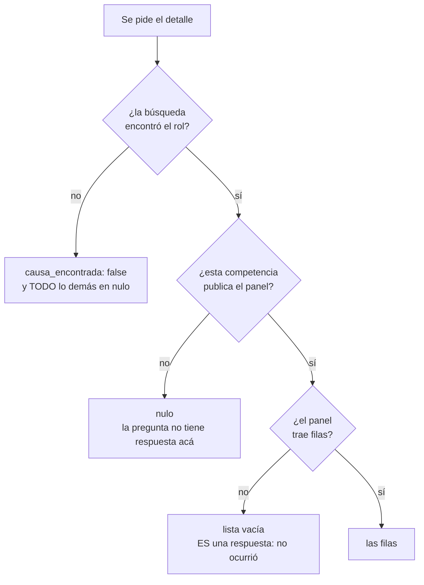

---
myst:
  html_meta:
    description: "Referencia de las 12 herramientas MCP, sus parámetros y cada campo que devuelven."
---

# Referencia de herramientas

Las 12 están anotadas en el protocolo como `readOnlyHint: true` y `destructiveHint: false`.

:::{note}
Las anotaciones MCP son **pistas**, no garantías verificables por el cliente. La garantía real
de que este servidor no escribe es que **el código de escritura no existe**, y hay un job de
CI que lo comprueba en cada cambio.
:::

## Directiva operativa

El servidor expone una directiva por el campo `instructions` del protocolo. Cualquier cliente
que se conecte la recibe **antes** de poder llamar una herramienta, así que la distinción
entre las dos fechas llega antes que cualquier resultado:

> Al informar fechas de actuaciones de receptor, distinguir siempre:
>
> - `fecha_diligencia`: cuándo el ministro de fe practicó la diligencia. **Es la que corre los
>   plazos procesales.**
> - `fecha_registro`: cuándo se registró en el sistema. **No** corre plazos.
>
> Suelen diferir en varios días. [...] Las causas reservadas no aparecen en la consulta
> pública: un resultado vacío no prueba que la causa no exista.

:::{note} Qué revisión del protocolo habla este servidor
La que trae el SDK de MCP instalado, que hoy es **2026-07-28**. Desde esa revisión el protocolo
es sin estado y los servidores deben implementar `server/discover`, donde éste publica su
nombre, su versión y estas herramientas.

El número no está escrito a mano: `tests/test_documentacion.py` lo compara contra
`LATEST_PROTOCOL_VERSION` del SDK, así que actualizar la dependencia y no esta página deja la
suite en rojo.
:::

## `listar_cortes`

Las Cortes de Apelaciones con el **código** que las búsquedas exigen. Sin parámetros.

Llamarla antes de buscar por nombre, RUT o fecha en `apelaciones`: ahí `corte` es obligatorio y
su valor no aparece en ninguna otra respuesta.

| Campo | Tipo | Qué es |
|---|---|---|
| `codigo` | int | Lo que va en el parámetro `corte` de las búsquedas |
| `nombre` | str | Nombre tal como lo publica la plataforma |

Medido el 20 de agosto de 2026: **17 cortes**.

```{include} _generado/listar_cortes.md
```

## `listar_tribunales`

Los tribunales de una corte, con el **código** que las búsquedas exigen.

:::{important} Es el muro de entrada
Para buscar en primera instancia hay que pasar `tribunal`, y ese número no aparece en ninguna
otra respuesta ni en esta página. Sin esta herramienta hay que sabérselo de memoria.
:::

| Parámetro | Qué es |
|---|---|
| `corte` | **Obligatorio.** Código de la corte, el que entrega `listar_cortes` |
| `competencia` | Sólo las que se acotan por tribunal. Los códigos difieren entre competencias |

`corte` no tiene valor por defecto a propósito: con uno, una consulta destinada a otra
jurisdicción devolvería en silencio los tribunales de Concepción, que es una lista plausible y
equivocada.

Suprema y apelaciones no se ofrecen, y está medido por qué: suprema devuelve `null` porque
**es** la corte y no tiene tribunales debajo, y apelaciones devuelve 118 juzgados de primera
instancia, que no son con qué se busca ahí.

| Campo | Tipo | Qué es |
|---|---|---|
| `codigo` | int | Lo que va en el parámetro `tribunal` de las búsquedas |
| `nombre` | str | Nombre tal como lo publica la plataforma |

### Cómo seguir un exhorto

El detalle entrega el tribunal de destino por su **nombre**, y la búsqueda pide el **código**.
Son tres llamadas:

1. `listar_cortes` para ubicar la corte del tribunal de destino.
2. `listar_tribunales` con esa corte, para sacar el código por nombre.
3. `buscar_causa_por_rit` con el `rol_destino` del exhorto y ese `tribunal`.

```{include} _generado/listar_tribunales.md
```

## `buscar_causa_por_rit`

Busca causas por rol en la consulta pública.

| Parámetro | Tipo | Descripción |
|---|---|---|
| `tipo` | str | Letra del rol. En civil: `C`, `V`, `E`, `A`, `F` o `I` |
| `rol` | int | Número, sin la letra ni el año |
| `anio` | int | Año, cuatro dígitos |
| `competencia` | str | Verificadas: `civil`, `laboral`, `cobranza`, `penal`, `suprema`, `apelaciones` |
| `tribunal` | int, opcional | Código del tribunal. Omitir para buscar en todos |
| `corte` | int, opcional | **Omitir salvo certeza** |
| `paginas` | int | Cuántas páginas recorrer como máximo. Al excederlo levanta excepción en vez de recortar |

:::{warning}
`corte` no tiene valor por defecto a propósito. Fijarla produce **falsos negativos**: en una
prueba real, una búsqueda con la corte puesta en Concepción omitió una causa del 11º Juzgado
Civil de Santiago que sí existía.
:::

Devuelve una lista de causas con `rol`, `fecha_ingreso`, `caratulado`, `tribunal` y una
`referencia` opaca que caduca a los 30 minutos.

```{include} _generado/buscar_causa_por_rit.md
```

:::{note} Con qué hay que acotar la búsqueda
Las tres búsquedas de abajo (nombre, RUT y fecha) exigen acotar, y **con qué depende de la
competencia**. Está medido una por una contra el sistema real:

```{include} _generado/acotacion.md
```

En apelaciones la plataforma responde *"Por favor seleccione una Corte para la búsqueda"* y no
entrega resultados. En suprema las tres andan sin corte ni tribunal.
:::

## `buscar_causa_por_nombre`

Busca causas por nombre de litigante.

Reglas de la plataforma, medidas probando cada combinación contra el sistema real:

- Exige **al menos dos de los tres campos de nombre** (nombre, apellido paterno, apellido
  materno). El **año no cuenta** para ese mínimo: `paterno + año` es rechazado, `paterno +
  materno` es aceptado.
- Exige **acotar la búsqueda** según la competencia (ver el cuadro de arriba). Donde el
  tribunal es obligatorio eso limita la utilidad de la herramienta: hay que saber dónde está
  la causa antes de poder buscarla.

| Parámetro | Tipo | Descripción |
|---|---|---|
| `apellido_paterno` | str | Apellido paterno del litigante |
| `apellido_materno` | str | Apellido materno |
| `nombre` | str | Nombres |
| `anio` | int, opcional | Año de ingreso. **No cuenta** para el mínimo de dos campos |
| `competencia` | str | Verificadas: `civil`, `laboral`, `cobranza`, `penal`, `suprema`, `apelaciones` |
| `tribunal` | int | Obligatorio salvo en `suprema` y `apelaciones` |
| `corte` | int | Obligatorio en `apelaciones`. En el resto, **omitir salvo certeza** |
| `paginas` | int | Tope de páginas a recorrer |

```{include} _generado/buscar_causa_por_nombre.md
```

## `buscar_causa_por_rut_juridica`

Busca causas de una persona jurídica por su RUT. Es la **única vía para empresas**, que no
tienen Clave Única y por lo tanto no aparecen en "Mis Causas".

Exige el dígito verificador, y acotar según la competencia (ver el cuadro de arriba).

| Parámetro | Tipo | Descripción |
|---|---|---|
| `rut` | int | RUT sin dígito verificador ni puntos |
| `digito_verificador` | str | Dígito verificador: 0-9 o K |
| `anio` | int, opcional | Año de ingreso |
| `competencia` | str | Verificadas: `civil`, `laboral`, `cobranza`, `penal`, `suprema`, `apelaciones` |
| `tribunal` | int | Obligatorio salvo en `suprema` y `apelaciones` |
| `corte` | int | Obligatorio en `apelaciones`. En el resto, **omitir salvo certeza** |
| `paginas` | int | Tope de páginas a recorrer |

```{include} _generado/buscar_causa_por_rut_juridica.md
```

## `buscar_causa_por_fecha`

Causas ingresadas en un rango de fechas.

| Parámetro | Tipo | Descripción |
|---|---|---|
| `desde` | str | Fecha inicial, DD/MM/AAAA |
| `hasta` | str | Fecha final, DD/MM/AAAA |
| `tribunal` | int | Obligatorio salvo en `suprema` y `apelaciones` |
| `competencia` | str | Verificadas: `civil`, `laboral`, `cobranza`, `penal`, `suprema`, `apelaciones` |
| `corte` | int | Obligatorio en `apelaciones`. En el resto, **omitir salvo certeza** |
| `paginas` | int | Tope de páginas a recorrer |

Es la cuarta búsqueda que la plataforma ofrece y responde una pregunta que las otras tres no:
qué ingresó contra alguien en un período, sabiendo el tribunal pero no el rol.

Un solo día en un solo tribunal puede devolver decenas de causas, así que conviene acotar el
rango antes de subir el tope de páginas: cada página son 100 resultados y una petición.

## `obtener_actuaciones_receptor`

Actuaciones del ministro de fe con su fecha real de diligencia. Es la razón de existir del
proyecto.

:::{warning}
Sólo **civil** entrega actuaciones por esta vía. En **cobranza** las diligencias del ministro de
fe viven en un panel propio (`diligenciaCob`) con otra estructura, que este proyecto todavía no
lee, así que la llamada se **rechaza**.

Su Historia sí nombra algunas, y por eso el rechazo: tres filas dicen `Actuacion - Receptor` y
ninguna trae fecha de diligencia, o sea leerlas de ahí daría una lista **parcial y sin el dato
que se busca**. Si son todas o sólo una parte no está medido, y entregarlas sería
informar una completitud desconocida como si fuera el total.

En laboral, penal, apelaciones y suprema no existen: en todo el sitio sólo hay
`receptorCivil` y `receptorCobranza`.
:::

Toma `tipo`, `rol`, `anio`, `competencia`, `tribunal` y `corte`, con el mismo significado que
en `buscar_causa_por_rit`. No toma `paginas`: de la búsqueda sólo usa la primera causa.

Internamente encadena búsqueda, detalle y un pase por cada cuaderno, porque la plataforma no
direcciona el detalle por rol. Son varias peticiones bajo el intervalo mínimo, así que tarda.

### Campos de la respuesta

| Campo | Tipo | Descripción |
|---|---|---|
| `folio` | str | Número de folio |
| `etapa` | str | Etapa procesal |
| `tramite` | str | Siempre `Actuación Receptor` |
| `desc_tramite` | str | Texto literal, sin normalizar |
| `fecha_diligencia` | date \| null | **La que corre los plazos**, ISO 8601 |
| `hora_diligencia` | time \| null | Cuando la descripción la trae |
| `fecha_registro` | date \| null | Ingreso al sistema. No corre plazos |
| `discrepancia_fechas` | bool | Las dos fuentes del sitio no coinciden |
| `cuaderno` | str | A qué cuaderno pertenece |
| `foja` | str | Foja |
| `georreferenciado` | bool | `true` significa que el sitio la OFRECE, no que exista: medido, una de seis abría un panel vacío. `false` significa **ausente** (art. 9 inc. 3 Ley 20.886) sólo donde la competencia publica la columna, y suprema no la publica |
| `estado_firma` | str \| null | Estado de firma del trámite. Cobranza lo publica en lugar de la foja; civil no lo trae |
| `correlativo` | str \| null | Correlativo interno del trámite. Sólo en suprema |
| `anio_tramite` | str \| null | Año que suprema publica en columna aparte, además de la fecha |
| `georreferencia_referencia` | str \| null | Con qué se pide la georreferencia de esta actuación |
| `tiene_documento` | bool | Si la columna `Doc.` ofrece algo. `true` NO garantiza que se pueda traer: con `documento_ruta` en nulo, la celda abre un modal de JavaScript cuyo endpoint no está medido |
| `tiene_anexo` | bool | Si la columna `Anexo` ofrece algo. Segundo canal de documentos, **todavía no pedible**: ninguna de sus rutas está verificada. `false` significa ausente sólo donde la competencia publica la columna |
| `documento_ruta` | str \| null | Qué ruta de la plataforma lo entrega. Cada competencia usa la suya |
| `documento_referencia` | str \| null | Con qué se pide ese documento. Sin ella se sabe que existe y no cuál es |

### Ejemplo

```json
{
  "folio": "3",
  "etapa": "Apremio",
  "tramite": "Actuación Receptor",
  "desc_tramite": "EMBARGO (Exitosa) Diligencia:31/03/2026 10:34",
  "fecha_diligencia": "2026-03-31",
  "hora_diligencia": "10:34:00",
  "fecha_registro": "2026-04-01",
  "discrepancia_fechas": false,
  "cuaderno": "2 - Apremio Ejecutivo Obligación de Dar",
  "foja": "0",
  "georreferenciado": true,
  "tiene_documento": true,
  "tiene_anexo": false,
  "documento_ruta": "docuN.php",
  "documento_referencia": "hHkPqx0yRb2..."
}
```

```{include} _generado/obtener_actuaciones_receptor.md
```


## `obtener_detalle_causa`

Historia, litigantes, notificaciones, liquidaciones, materias y los dos lados del exhorto,
leídos de **una sola cadena de peticiones**. Recorre todos los cuadernos, no sólo el que la plataforma muestra
por defecto.

**No es el expediente completo.** El detalle publica más paneles de los que este servidor sabe
leer: los escritos todavía no están medidos, así que su ausencia acá
NO significa que la causa no los tenga.

:::{warning}
**La columna `Anexo` es un segundo canal de documentos y no se puede pedir.** Cada actuación
declara `tiene_anexo`, pero ahí termina lo que este servidor puede hacer: la celda abre un modal
de JavaScript, y las dieciocho rutas que ese JavaScript nombra son candidatas leídas del sitio,
no rutas verificadas contra la plataforma. Se declaran como no medidas en vez de pedirse a
ciegas.

Un folio con `tiene_anexo` en verdadero tiene algo que este servidor no entrega. Hay que ir al
expediente. Vale igual para las piezas de exhorto: `PiezaExhorto` declara el mismo campo,
porque el panel de piezas publica la misma columna.
:::

:::{important} Preferir ésta antes que preguntar por partes
Los paneles vienen juntos en la misma respuesta HTML. Pedirlos por separado multiplica las
consultas contra la plataforma sin traer nada nuevo: preguntar cuatro cosas de una causa con
dos cuadernos costaba **dieciséis** peticiones donde bastan **cuatro**, sin contar en ninguno
de los dos las dos que abren la sesión.

Medido de punta a punta contra la plataforma el 20 de agosto de 2026, con C-1156-2026: **seis
peticiones**, todas 200, con los dos cuadernos y el exhorto incluidos.
:::

Cada campo distingue tres estados, y los dos últimos significan cosas distintas:

| Valor | Qué significa |
|---|---|
| **nulo** | Esta competencia no publica ese panel. La pregunta no tiene respuesta acá |
| **lista vacía** | El panel existe y no trae filas. Es una respuesta |
| **con elementos** | Lo que hay |

```{include} _generado/paneles.md
```

Y un campo que no es un panel: `causa_es_exhorto`. Existe porque en `piezas_exhorto` el nulo
podía significar dos cosas, que la competencia no publica el panel o que **esta causa** no es
un exhorto, y meterlas en el mismo nulo borra la distinción que el resto del modelo protege.

| `causa_es_exhorto` | Qué significa |
|---|---|
| nulo | La pregunta no está medida en esta competencia |
| falso | La causa no es un exhorto, y por eso `piezas_exhorto` viene en nulo |
| verdadero | Lo es, y `piezas_exhorto` trae lo que el tribunal de origen le mandó |

Sale de la cabecera de la causa, no de que el panel esté presente: deducirlo de la presencia
ataría la afirmación a que la plataforma no renombre un `id`, y el día que lo renombre la
respuesta diría "esta causa no es un exhorto" en vez de "no pude leerlo".

El mismo dato como grafo, útil para ver de un vistazo qué competencia sirve para qué pregunta.
Se genera desde el código igual que la tabla, así que no puede quedar viejo:

```{include} _generado/paneles-grafo.md
```

Y los tres estados que hay que respetar al informar. La rama de la izquierda es la que este
proyecto existe para no borrar: "acá no se informa" no es "no ocurrió".



:::{warning} Al computar plazos
`fecha_diligencia` de la historia viene en **nulo** salvo en civil y cobranza. Y las
notificaciones incluyen las **no practicadas**, que se distinguen por su `estado`: una fila
pendiente no hizo correr ningún plazo.

Los litigantes traen **RUT de personas naturales**: son datos personales de terceros.

Y si `exhortos` trae algo, parte de la tramitación ocurre en **otro expediente**: el exhorto
abre una causa nueva en el tribunal destino, con su propio rol, y las actuaciones de esa parte
no están acá. Un plazo que corre por una diligencia exhortada no se computa desde esta causa.
:::

| Parámetro | Tipo | Descripción |
|---|---|---|
| `tipo` | str | Letra del rol, o el libro en Cortes de Apelaciones |
| `rol` | int | Número, sin la letra ni el año |
| `anio` | int | Año, cuatro dígitos |
| `competencia` | str | Las verificadas. `penal` se rechaza: ningún panel suyo está medido |
| `tribunal` | int, opcional | Código del tribunal |
| `corte` | int, opcional | **Omitir salvo certeza** |

```{include} _generado/obtener_detalle_causa.md
```

## `obtener_georreferencia`

Dónde y cuándo el ministro de fe registró que practicó una diligencia. Es el registro del
art. 9 inc. 3 de la Ley 20.886.

| Parámetro | Qué es |
|---|---|
| `georreferencia_referencia` | Lo entrega cada actuación. Cuando viene nula, esa actuación no la ofrece |
| `competencia` | Sólo las que publican la columna. Suprema no la publica |

:::{important} Trae la única hora del proyecto
Las dos fechas de la Historia son del día. Ésta viene del aparato con que se tomó la
coordenada, así que es una **tercera fuente** sobre cuándo ocurrió la diligencia, independiente
de las dos que el sitio publica en la tabla.

No reemplaza a `fecha_diligencia`, que es la que corre los plazos. Sirve para contrastarla, y
si no coinciden hay que informarlo, no elegir.
:::

| Campo | Tipo | Qué es |
|---|---|---|
| `existe` | bool | Falso cuando la actuación la ofrecía y el panel respondió que no hay ninguna |
| `latitud` / `longitud` | float \| null | Como las publica el sitio |
| `precision_metros` | float \| null | Radio de incertidumbre. Medidas: 6,0 · 10,04 · 26,68 · 56,22 · **103,13** |
| `fecha_dispositivo` | date \| null | Cuándo el aparato tomó la coordenada |
| `hora_dispositivo` | time \| null | La hora de esa toma |
| `intentos` | int \| null | Cuántas veces el aparato intentó fijar la posición |

:::{warning} La precisión varía mucho, y con 103 metros la ubicación no identifica un domicilio
Medidas en una sola causa: 6,0 · 10,04 · 26,68 · 56,22 y **103,13 metros**. Un radio de 103
metros abarca una manzana entera en zona urbana, así que la coordenada dice el sector y no la
puerta. Informar la precisión junto con las coordenadas, siempre: sin ella el punto se lee como
exacto.
:::

**`existe: false` no es lo mismo que no haber preguntado**, y está medido: de las seis
actuaciones georreferenciadas de una causa, una abre un panel que dice que no hay ninguna.

Cuesta **una petición por actuación**, con su intervalo. Se pide de la actuación concreta que
importa, nunca de todas: para las seis de una causa de dos cuadernos serían seis peticiones más
sobre las seis que ya costó leerla.

Trae coordenadas de un domicilio de terceros, con el mismo criterio que el RUT de los
litigantes: es lo que la plataforma publica.

```{include} _generado/obtener_georreferencia.md
```

## `obtener_documento`

El archivo de una actuación: la resolución, el escrito, el certificado o el expediente entero.

| Parámetro | Qué es |
|---|---|
| `documento_ruta` | Lo entrega cada actuación. Sólo se aceptan las rutas que la plataforma emite |
| `documento_referencia` | Lo entrega cada actuación. Identifica el documento |
| `competencia` | Bajo qué módulo cuelga la ruta. `docCertificadoEscrito.php` existe en tres |

No pide el rol: la referencia ya identifica el documento, y buscar la causa antes serían dos
peticiones que no verifican nada.

:::{note} La referencia NO muere con la sesión
Se emite al dibujar la página y el mismo documento llega con una distinta en cada render, así
que **no es la identidad estable** del archivo. Pero es un token firmado y no un identificador
de sesión: **medido el 20 de agosto de 2026**, sirve desde una sesión distinta de la que la
emitió, así que el flujo normal, leer el detalle con una herramienta y pedir el documento con
otra, funciona.

Cuánto dura no está medido. Pedir el documento cerca de leer la actuación sigue siendo lo
prudente, y una referencia que la plataforma ya no acepte devuelve una página de error con
HTTP 200, no un "no existe": por eso se verifica que lo que llegó sea un PDF.
:::

### Chico viaja entero, grande viaja como enlace

Un documento bajo el umbral viene completo en la respuesta. Uno grande viene como **enlace**,
con su tamaño, y se lee con `resources/read` **sólo si de verdad hace falta**: el ebook es el
expediente entero, y meterlo en la respuesta gasta el contexto de la conversación en algo que
casi nunca se lee completo.

El umbral sale de la aritmética de base64, que son cuatro caracteres por cada tres bytes, con
el techo de una respuesta de texto. Deja el enlace como caso normal y lo embebido como
excepción, que es el lado barato de equivocarse.

### Un escaneo se declara y NO se transcribe

Si el PDF no trae capa de texto es una imagen, y eso se dice. **No se le pasa OCR**: una
transcripción automática de una resolución se ve idéntica a la resolución y no lo es, y eso es
peor que una lista vacía, porque la lista vacía se nota.

Y un documento **mixto** se declara mixto. Un expediente que agrega anexos escaneados a
resoluciones digitales es lo normal, y decir "trae capa de texto" a secas haría dar por
transcribible un archivo del que una parte son imágenes: `paginas_con_texto` dice cuántas, y lo
que dicen las otras no se puede citar desde acá.

Si el archivo no se puede abrir, la capa de texto queda **nula y no falsa**: no saber si tiene
texto no es lo mismo que saber que no tiene.

### El recurso `pjud://documento`

Es el otro extremo del enlace. Leerlo **vuelve a consultar** al Poder Judicial, con su
intervalo: no hay copia guardada de nada, que es la regla 5 del proyecto.

```{include} _generado/obtener_documento.md
```

## `buscar_jurisprudencia`

Sentencias de la Corte Suprema desde el Buscador Unificado de Fallos. Sirve sobre todo para
**verificar que una cita existe** antes de usarla: con `rol` y `anio` devuelve la sentencia con
su caratulado, sala, fecha, ministros y enlace permanente.

| Parámetro | Tipo | Descripción |
|---|---|---|
| `rol` | int, opcional | Rol ante la Corte Suprema, sin el año |
| `anio` | int, opcional | Año del rol |
| `todas` | str, opcional | Texto libre: deben aparecer todas estas palabras |
| `literal` | str, opcional | Frase exacta |
| `excluir` | str, opcional | Palabras que no deben aparecer |
| `desde` / `hasta` | str, opcional | Rango de fechas, DD/MM/AAAA |
| `filas` | int | Cuántas traer, de 1 a 250 |
| `buscador` | str | `suprema`, `apelaciones` o `laborales` |

Exige al menos un criterio: sin ninguno el buscador devuelve el índice entero, y eso no es una
búsqueda.

:::{warning}
**`ocultas` sólo tiene significado en `suprema`, y está medido.**

| Buscador | Rol que existe | Rol imposible | Qué cuenta |
|---|---|---|---|
| `suprema` | 2 y 2 | 0 y 0 | la consulta |
| `laborales` | 8 y **269.264** | 0 y **269.264** | el índice completo |

En `laborales` el número que la plataforma entrega es el tamaño del corpus, así que la
diferencia contra lo visible no son coincidencias reservadas. Informar 269.256 ocultas para una
consulta que encontró 8 haría ver cada resultado como una fracción de un universo oculto que no
existe, así que ahí `ocultas` y `coincidencias` vienen en **nulo**.

**Nulo no es cero.** Cero significa "no hay nada reservado"; nulo significa "en este buscador no
se puede saber", y entonces un resultado vacío puede igual corresponder a algo reservado.
`apelaciones` está en nulo por precaución: los cuatro intentos de medirlo murieron por timeout.
:::

:::{warning}
En `suprema`, el resultado trae **`ocultas`**: cuántas coincidencias existen y no se entregan a una consulta
anónima. Medido el 16 de agosto de 2026 sin filtros, el buscador declaraba **1.223.925**
coincidencias y entregaba **300.005**.

Si `ocultas` es mayor que cero, la lista es un subconjunto. No se puede afirmar que algo no
existe porque no aparezca, y `condiciones_de_publicacion` desglosa **todas** las
coincidencias por su condición (`Excluido salud`, `Anonimizadas`, `Reservado restringido`,
`Publicable`, entre otras). Ese desglose suma `coincidencias`, **no** `ocultas`: incluye a las
visibles. El buscador no publica su regla de visibilidad, así que no se puede decir qué
categorías componen las que faltan.

El propio sitio dejó de mostrar ese aviso: los dos mensajes que lo decían siguen en su
JavaScript, comentados.
:::

### Campos de la respuesta

`sentencias`, más cinco campos de completitud: `visibles`, `coincidencias`, `ocultas`,
`no_entregadas` y `condiciones_de_publicacion`.

**`ocultas` en cero no significa que la lista esté completa.** Son dos recortes distintos y
hay que mirar los dos: `ocultas` son las coincidencias que la plataforma reserva a una consulta
anónima, y `no_entregadas` son las visibles que esta llamada no trajo porque `filas` acota
cuántas se piden. Una búsqueda con 400 visibles y `filas` en 10 devuelve diez sentencias,
`ocultas` en cero y `no_entregadas` en 390.

`no_entregadas` es además la única señal de recorte que funciona en los tres buscadores:
`ocultas` viene en nulo en `apelaciones` y en `laborales`.

`coincidencias` es lo que el buscador declara **antes** de aplicar su filtro de condición de
publicación. No es el tamaño del índice: el Poder Judicial habla públicamente de más de un
millón y medio de sentencias, y esa diferencia no está explicada.

Cada sentencia trae `rol`, `caratulado`, `fecha_sentencia` (ISO 8601), `sala`, `tipo_recurso`,
`resultado_recurso`, `corte_origen`, `rol_corte_apelaciones`, `redactor`, `ministros`,
`condicion_publicacion`, `anonimizada` y `url`.

No trae el texto completo del fallo. La respuesta del buscador lo incluye, pero diez sentencias
serían megabytes con nombres y cédulas de personas naturales: se entrega el enlace permanente y
quien lo necesite entra.

Están verificados tres de los diez buscadores: **suprema**, **apelaciones** y **laborales**.
Se eligen con el parámetro `buscador`.

Cada uno declara sus propios campos, y ésa es la razón de que esto sea una tabla y no un
parser por buscador: Corte Suprema identifica sus sentencias con `rol_era_sup_s` y Apelaciones
con `rol_era_ape_s`, así que un cliente que asumiera los campos del primero devolvería el rol
vacío en el segundo sin que nada reviente. En **laborales** el origen es un juzgado y no una
corte, así que `corte_origen` trae el juzgado.

Los siete restantes se rechazan en vez de adivinar sus campos.

:::{warning}
En **laborales** el rol que el buscador publica **no lleva la letra del tipo de causa**. Medido:
pedir el rol 364 del año 2020 devuelve `O-364-2020` aunque lo buscado sea `T-364-2020`, que es
otra causa. Una respuesta con el mismo número **no prueba** que sea la misma causa: hay que
comparar el caratulado.

Es el falso positivo simétrico del que motivó el proyecto. Acá no es que falte un dato: es que
sobra uno que parece el correcto.
:::

```{include} _generado/buscar_jurisprudencia.md
```

## `obtener_texto_sentencia`

El texto completo de una sentencia, de una en una.

| Parámetro | Tipo | Descripción |
|---|---|---|
| `rol` | int | Rol de la sentencia, sin el año |
| `anio` | int | Año del rol |
| `buscador` | str | `suprema`, `apelaciones` o `laborales` |

Está separado de la búsqueda a propósito, y la razón es de tamaño: **una sentencia de trece
páginas son unos 25.000 caracteres**, medido. Devolver diez con cada búsqueda serían 250.000.
La búsqueda entrega `texto_preview`, más la extensión en palabras y páginas, que suele bastar
para decidir si vale pedir el resto.

:::{warning}
El texto trae los nombres de quienes fueron parte, y cuando el fallo no está anonimizado
también sus cédulas.

`anonimizada` dice si lo entregado es la versión con los datos suprimidos por el propio
tribunal, y `fuente` dice cuál de los dos campos del buscador se leyó (`texto_sentencia` o
`texto_sentencia_anon`). Se informan las dos cosas para que quien lea sepa qué está leyendo.
:::

### Campos de la respuesta

`rol`, `anonimizada`, `fuente`, `palabras`, `paginas` y `texto`.

Si la sentencia existe en el índice pero está reservada para consultas anónimas, se levanta
`PlataformaRechaza` con el número de coincidencias reservadas, en vez de devolver un texto
vacío. Distinguir "existe y no se publica" de "no existe" es el punto.

## Errores

| Excepción | Qué significa | Qué hacer |
|---|---|---|
| `PjudBloqueado` | 403 o 429, o no se pudo derivar el prefijo de rutas | **Detenerse.** Revisar si la IP quedó bloqueada antes de reintentar nada |
| `PlataformaRechaza` | La plataforma rechazó la consulta por sus propias reglas | El mensaje es el suyo, textual. Corregir los parámetros |
| `ValueError` sobre campos | Faltan campos que la plataforma exige | Se detecta antes de consultar, sin gastar una petición |
| `EstructuraInesperada` | El HTML no tiene la forma esperada | La plataforma cambió. Reportar con la plantilla correspondiente |
| `ValueError` | Competencia o buscador no verificado, o falta `MCP_PJUD_CONTACTO` | Corregir la llamada o la configuración |
| `httpx.HTTPStatusError` | La plataforma respondió 5xx | Error suyo, no de la consulta. No está envuelto en una excepción propia porque no hay nada que interpretar: se reintenta más tarde, respetando el intervalo |

El SDK de MCP convierte una excepción en un resultado con `is_error: true` y el mensaje como
contenido, así que el cliente ve el error en vez de recibir una lista vacía que parecería
decir "no hubo actuaciones".
