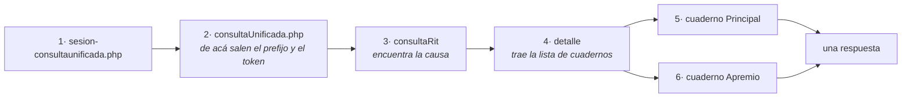

---
myst:
  html_meta:
    description: "Qué se va a hacer y en qué orden, con lo que se decidió no hacer y por qué. Para quien evalúa hacia dónde va."
---

# Hoja de ruta y estado de verificación

## Versionado

[SemVer](https://semver.org/lang/es/). La versión mayor es `0`, y eso significa que **la API
pública puede cambiar sin aviso entre versiones menores**.

Hay una razón adicional para no apurar el `1.0.0`: este software depende del HTML de un
tercero que puede cambiar cualquier día. Prometer estabilidad de interfaz sería prometer algo
que no controlamos.

### Condiciones para llegar a 1.0.0

Las tres, no dos de tres:

1. **Más de una competencia verificada** contra el sistema real, con fixtures propias.
2. **Esquema de salida estable**, sin cambios de campos por al menos dos versiones menores.
3. **Seis meses sin que un cambio de la plataforma rompa el parser**, o con al menos un cambio
   detectado y corregido dentro de la semana.

## Hoja de ruta

### 0.2: paginación y varias causas — hecho

Los controles de paginación se parsean, el listado se recorre entero y existen las búsquedas
por nombre y por RUT de persona jurídica. El recorrido levanta `ResultadosTruncados` al llegar
al tope en vez de devolver una lista recortada.

Quedó decidido lo que estaba en duda: **no se encadenan las actuaciones de todas las causas de
un listado**. Doce causas son unas sesenta peticiones, y bajo el régimen sostenido de una cada
5 segundos eso son unos cinco minutos: la ráfaga alcanza para la primera causa y no cambia el
total. La respuesta correcta es devolver el listado para que el usuario elija cuál abrir.

### 0.3: jurisprudencia — hecho parcialmente

Existe `buscar_jurisprudencia` contra el buscador de Corte Suprema. Lo que falta está en la
sección de jurisprudencia, más abajo.

### 0.4: las seis competencias buscables — hecho

Las cuatro búsquedas (`consultaRit*`, `consultaNombre*`, `consultaJuridica*` y
`consultaFecha*`) están verificadas en las seis competencias que el servidor expone, cada una
con su fixture real anonimizada.

Lo que las bloqueaba resultó ser un solo campo, y conviene dejar escrito el diagnóstico
equivocado porque era plausible y costó dos intentos: se creyó que sobraban los campos que el
sitio deshabilita (`conTipoCausa`, `conCorte`, `conTribunal`), y que faltaba un código de libro
en `conTipoCausa`. **Las dos cosas eran falsas.** El combo de libros existe
(`json/cmbTipos.php`) y devuelve cero bytes para suprema, y la búsqueda anda igual con o sin
los campos deshabilitados. Faltaba `radio-group`, el radio RIT/RUC del formulario, en el que su
PHP se ramifica para saber por cuál de los dos se busca.

Se encontró bisectando desde el juego de campos que fallaba, no leyendo más JavaScript.

**Y el arreglo salió incompleto, que es la parte que conviene no olvidar.** `radio-group`
desbloqueó a suprema y apelaciones, pero `penal` tiene su propio radio (`radio-groupPenal`) y
siguió rota; las tres se declararon verificadas y se publicaron así en la 0.2.0. La causa es
una sola: se midieron con peticiones armadas a mano y los tests usan dobles, así que nada
ejercitó `buscar_por_rit` contra la plataforma. Verificar la petición no es verificar el
cliente. Los campos propios de cada competencia salen ahora de la tabla, con un test que
compara el formulario enviado contra lo que ella declara.

**Lo que sigue pendiente es lo que da valor**, y es más chico de lo que parecía:

- **`diligenciaCob`**: cobranza tiene ministro de fe y sus diligencias viven en un panel
  aparte, con estructura propia (`Estado Diligencia`, `Tipo Diligencia`, `Destinatario`,
  `Responsable`). Su Historia **sí nombra algunas**: tres filas dicen `Actuacion - Receptor`,
  sin tilde y con guion, y ninguna trae fecha de diligencia. Hoy `actuaciones_receptor` rechaza
  cobranza, y es lo correcto mientras el panel no esté medido: no se sabe si esas tres son
  todas, y entregarlas se leería como el total.

  **Medido, y la respuesta es que hoy no sirve.** De cinco causas de cobranza, sólo una trae
  filas en ese panel, y sus tres diligencias traen `31/12/1969` en la columna de fecha: el
  epoch, o sea el valor cero renderizado. Ninguna trae la fecha doble que este proyecto lee en
  civil. Construir sobre eso entregaría actuaciones sin la fecha que corre los plazos, que es
  peor que no entregarlas. Queda a la espera de encontrar una causa donde el panel sí publique
  fechas.

- **Las notificaciones son otra fuente de fechas, y no son uniformes.** Buscando lo anterior
  apareció que cobranza publica `notificacionCob` con DOS columnas de fecha, `Fec.Not.` y
  `Fec.Tram.`, que difieren: las notificaciones por correo electrónico coinciden y las por
  carta van con un día de diferencia. Civil publica otra cosa: el panel se llama
  `notificacionesCiv`, tiene ocho columnas y **una sola** fecha.

  Es la lección de cobranza repetida: mismo concepto, estructura distinta por competencia.
  **Resuelto en la 0.4.0**, cuando apareció una causa civil con tres notificaciones reales y
  se pudo medir en vez de adivinar: los dos paneles se leen, cada uno con sus columnas, y
  `fecha_notificacion` va nula donde la competencia no la publica en vez de copiar la de
  trámite.

- **Laboral, penal, suprema y apelaciones no tienen receptor.** En todo el sitio sólo existen
  `receptorCivil` y `receptorCobranza`. Queda declarado en la tabla y se rechaza antes de
  gastar una petición.

### 0.5: el resto del detalle de causa — hecho parcialmente

`webscrapthings` cubre esto desde 2025 y un abogado lo espera. Se divide en dos, porque el
costo no es el mismo:

**Sin peticiones nuevas.** Ya vienen en la respuesta del detalle que el cliente pide, y ése
era el punto: `obtener_detalle_causa` los lee todos de una sola cadena. Preguntar las cuatro
cosas de una causa con dos cuadernos costaba dieciséis peticiones y ahora cuesta cuatro.

La cadena entera, medida en vivo con C-1156-2026 el 20 de agosto de 2026. Las dos primeras
abren la sesión, y por eso el total es seis y no cuatro:

Los paneles que NO son la historia se deduplican por contenido: no llevan el cuaderno en la
fila, así que si el sitio los repite en cada uno llegarían dos veces.

- `litigantesCiv`: quiénes son parte y con qué calidad. **Hecho**, en las cinco competencias
  con detalle mapeado
- `notificacionesCiv`: con su propio estado y su propia fecha de trámite. **Hecho**
- `liquidacionCob` y `materiasLab`: cuánto se debe, y qué se litiga. **Hecho**
- `escritosCiv`: los presentados, y cuáles siguen por resolver. Falta
- `exhortosCiv`: el exhorto visto desde el tribunal de origen. **Hecho**
- `piezasExhortoCiv`: el exhorto visto desde el otro lado. **Hecho**, con un campo aparte que
  dice si la causa es un exhorto. Ver abajo

Lo que falta importa más de lo que parece: mientras el de escritos no esté, la respuesta del
detalle NO es el expediente completo, y su contrato tiene que decirlo para que nadie lea la
ausencia de un escrito como que la causa no lo tiene.

Los dos lados del exhorto están medidos y la tabla vive en {doc}`verificacion`.

`exhortosCiv` se lee desde el origen y `piezasExhortoCiv` desde el destino: los dos están
cubiertos. Mapear el segundo tenía una decisión de contrato antes que de código, porque en
`DetalleCausa` el `None` ya significaba "esta COMPETENCIA no publica el panel" y acá hacía
falta decir "esta CAUSA no es un exhorto", que no es lo mismo. Sobrecargar `None` con los dos
sentidos es exactamente la distinción que este proyecto existe para no borrar.

Se resolvió con la **cabecera de la causa**, que hasta entonces no se leía de ninguna
competencia: el rótulo `Proc.` dice `Exhorto` cuando la causa lo es, y de ahí sale la respuesta
sin inferirla de qué paneles llegaron. Al lado de `piezas_exhorto` viaja `causa_es_exhorto`,
con el mismo oficio que `causa_encontrada`: nombrar cuál de los dos silencios es éste.

Las dos lecturas se contrastan y una contradicción levanta, porque las dos salidas silenciosas
pierden datos. Si el sitio renombra el `id` del panel, creerle al panel diría "esta causa no es
un exhorto" y las piezas desaparecerían sin error; al revés, un panel que llegue en una causa
que la cabecera no declara exhorto no se descarta por la cabecera.

**Una petición cada uno, con su intervalo.** Son modales que la plataforma carga aparte, y hay
que contarlos en el tiempo total:

- `modal/detalleExhortos.php`, que la fila del exhorto invoca con su propia referencia
- `modal/causaOrigenCivil.php`

### 0.6: Programación de Sala — medido, y no es lo que esta página decía

Acá había un mapeo listo para implementar, sacado de leer `automatizador-legal`: `progComp`,
`progCorte`, `progRolCausa`, `progEraCausa`, `progTipoCausa`, `btnProgConsulta` y
`dtaTableDetalleProgSala`. **Ninguno de los siete existe.** Medido el 20 de agosto de 2026:
cero ocurrencias en `consultaUnificada.php` y cero en la página real.

Tres cosas resultaron distintas de lo que decía:

**Está en otro host.** `https://salas.pjud.cl/monitor/monitor.php`, no en la Oficina Judicial
Virtual. Se llega desde la portada, que lo enlaza.

**No comparte cortafuegos con los otros dos.** OJV y `juris.pjud.cl` responden con la cookie
`TS<hex>` de F5 BIG-IP, y por eso la detención total es del proceso y no del host. `salas`
responde `Server: Apache`, sin esa cookie y sin `Via`. Es una diferencia medida, no una
suposición, y habría que decidirla antes de consultarlo desde acá: el motivo de la detención
total no es técnico, es no escalar contra la institución, y eso no cambia con el host.

**Y no es una consulta por causa.** Se llama "Monitor de Salas" y pide *"Seleccione Corte y
Sala que desea visualizar"*: dos desplegables, `corte` (que viaja como `cod_corte`) y `sala`,
que se llena con `controlador/listaSalaPorCorte.php`. **No recibe un rol.** Es un tablero de
qué se está viendo ahora en una sala, no la respuesta a "¿cuándo me ven?".

Un detalle más que conviene tener anotado: los valores del desplegable de corte vienen
cifrados (`t+r7m+HbenMm8+DvHDPmhBvuw50npbnCNFmLW+Sp4RM=`), **no son los códigos numéricos que
usa la Oficina Judicial Virtual**. Son dos sistemas con dos vocabularios.

Queda como pregunta abierta y no como tarea: si lo que se quería era "¿cuándo me ven?", esto no
lo responde, y dónde vive esa consulta, o si existe, no está medido.

### 0.7: documentos

No es una ruta, son seis, y estaban a la vista en las fixtures. Todas son `GET` con un solo
parámetro oculto que lleva una referencia opaca, igual que el resto del sitio:

Las seis rutas y su parámetro están en {doc}`verificacion`.

**Y hasta ahora la respuesta no decía cuál documento.** `tiene_documento` era un booleano: la
actuación informaba que HAY documento y no CUÁL, y con eso no se puede pedir. La referencia
estaba en la misma celda, en el campo `dtaDoc` del formulario, y se descartaba. Corregido: cada
actuación trae su `documento_referencia`, que es lo único que permite pedir el archivo sin
volver a consultar el detalle entero.

#### Cómo se devuelve un documento sin reventar el contexto

El ebook es el expediente completo. Meterlo en la respuesta de una herramienta, aunque sea en
base64, gasta el contexto del modelo en algo que probablemente no necesita leer entero, y el
costo lo paga la conversación del abogado.

La especificación del protocolo tiene la pieza para esto y no hace falta inventarla. En la
revisión `2026-07-28` una herramienta puede devolver:

| Forma | Qué es | Cuándo |
|---|---|---|
| `ResourceLink` | Un puntero con `uri`, `mimeType` y `size`, sin el contenido | El ebook y cualquier documento largo. El cliente lo lee con `resources/read` **sólo si lo necesita** |
| `EmbeddedResource` con `BlobResourceContents` | El contenido en base64, dentro de la respuesta | Un documento chico que el modelo sí tiene que leer ahora |

`ResourceLink` trae `size`, así que el cliente puede decidir **antes** de gastar el contexto.
Ésa es la diferencia con devolver el PDF y esperar que a nadie le explote la ventana.

#### Extraer texto: qué biblioteca, y por qué la licencia decide

Lo medido por terceros y publicado, no por este proyecto:

| Biblioteca | Licencia | Velocidad | Nota |
|---|---|---|---|
| PyMuPDF | **AGPL-3.0** | 8 a 12 veces más rápida | Trae OCR y detección de tablas |
| pdfplumber | MIT | La más lenta de las tres | Mejor en tablas de documentos financieros |
| pypdf | BSD-3 | Intermedia | Python puro, sin dependencias binarias |

**La velocidad no decide acá, la licencia sí.** Este proyecto se distribuye bajo PolyForm
Strict, y publicar una rueda que enlaza código AGPL pone las dos licencias en conflicto. Con
eso PyMuPDF queda fuera aunque sea la más rápida, y quedan pypdf y pdfplumber.

#### Un PDF sin capa de texto es un escaneo, y ahí NO se transcribe

Detectarlo es barato: si no se extrae texto, es una imagen. Lo que no corresponde es pasarle
OCR y entregar el resultado como el texto del documento.

Una transcripción automática de una resolución judicial **se ve idéntica a la resolución y no
lo es**. Es peor que la lista vacía de la regla 4: la lista vacía se nota, un texto plausible
con una palabra cambiada no. Lo correcto es decir que el documento es un escaneo y entregar el
documento, no una versión de él.

#### Y la parte que no es técnica

Traer un PDF a disco cambia el perfil de retención del proyecto y entra de lleno en la Ley
21.719. La regla 5 dice que no se persisten datos de terceros, así que si un documento se
guarda, lo guarda quien llama y no este servidor: ruta elegida por el usuario, consentimiento
explícito por llamada, y nada escrito por defecto.

### 0.7a: los códigos de tribunal — hecho

**Era el muro de entrada del proyecto.** Para buscar una causa en primera instancia hay que
pasar `tribunal=162`, y ese número no aparecía en ninguna parte de la respuesta ni de esta
documentación: quien no lo supiera no podía usar el servidor. Lo resuelven `listar_cortes` y
`listar_tribunales`.

Las rutas y lo que devuelven están en {doc}`verificacion`.

Y es lo que hace **seguible** la arista del exhorto. El detalle entrega el tribunal de destino
por su nombre ("1º Juzgado Civil de Chillán") y la búsqueda exige un entero, así que son tres
llamadas: ubicar la corte, sacar el código del tribunal, y buscar la causa por su rol.

El exhorto trae además su propia referencia, que es como la plataforma abre su detalle. Se
guarda sin usarla: `detalleExhortos.php` sigue mapeado y sin ejecutar, y cuando se mida el dato
ya está. **No sirve como identidad**: el mismo exhorto llega con una referencia distinta en
cada cuaderno, así que la deduplicación las ignora a propósito.

(07b-la-georreferencia-medida-y-trae-una-tercera-fecha)=

### 0.7b: la georreferencia — hecha

Hoy la Historia sólo dice si una actuación tiene georreferencia. Detrás del modal hay más de lo
que esta página suponía. Lo medido está en {doc}`verificacion`.

**Y trae fotos y videos.** El modal tiene tres pestañas: `mapasGeoRef`, `imagenesGeoRef` y
`videosGeoRef`. **Las seis actuaciones medidas traen las dos últimas vacías**, así que no hay
ni una imagen observada todavía.

Se anotó una vez que había que decidir si entregarlas, y esa duda estaba mal planteada: el
proyecto ya entrega **RUT de personas naturales**, que identifica más que una fotografía, y lo
justifica porque es lo que la plataforma publica y lo que identifica a una parte sin
ambigüedad. Entregar lo que el Poder Judicial publica es lo que este servidor hace; la regla 5
prohíbe **persistirlo**, que es otra cosa.

Lo que sí sigue en pie, y es la regla 6: si alguna vez se guarda una respuesta con imágenes
como fixture, esa fixture hay que anonimizarla igual que las demás.

Cuesta **una petición por actuación**, con su intervalo. Para las ocho de receptor de
E-468-2026 serían ocho peticiones más, así que va a pedido de una actuación concreta y nunca de
barrido.

### 0.8: el detalle de las competencias ya buscables — hecho, salvo penal

Las cuatro se pidieron y se midieron sobre una causa real. Tres quedaron mapeadas y expuestas
por `obtener_detalle_causa`; penal no, y la razón es la de siempre.

| Competencia | Panel | Qué la distingue |
|---|---|---|
| `laboral` | `movimientoLab` | Como civil, con `Estado` donde civil pone `Foja` |
| `suprema` | `movimientosSup` | Sin `Etapa` ni `Georref.`; agrega `Salas`, `Correlativo` y el año |
| `apelaciones` | `movimientosApe` | Llama `Descripción` y `Fecha` a lo que civil llama `Desc. Trámite` y `Fec. Trámite`, y su georreferencia se escribe `Georeferencia` |
| `penal` | `historiaPen` | **Cero filas**, igual que sus otros tres paneles |

**Penal queda sin mapear a propósito.** El panel existe y sus encabezados están a la vista, pero
la causa medida no trae ninguna fila: declarar sus columnas sería escribir un mapa que nada
comprobó. Hace falta encontrar una causa penal con historia y volver a medir.

**Ninguna de las cuatro tiene receptor.** La palabra no aparece ni una vez en las tres
respuestas mapeadas, y ninguna fila trae la fecha doble. Por eso la historia se lee aparte de
las actuaciones del receptor: en esas competencias la pregunta que origina el proyecto no tiene
respuesta, y sin ella lo único disponible ahí era la búsqueda.

Un detalle del recorrido que conviene no perder: el nombre del panel se guarda completo y no
como sufijo. Antes el código anteponía `historia`, lo que funcionaba con dos competencias que se
llamaban así y no generaliza: dos de las nuevas van en plural (`movimientos…`) y una en singular
(`movimiento…`).

### 0.9: familia

La única competencia que no se expone, y no por falta de medición: la propia plataforma
responde que las causas de familia son reservadas y sólo se llega a ellas por Clave Única,
desde "Mis Causas". Queda fuera de alcance mientras eso siga así.

### Sin versión asignada

**Detección de cambios entre consultas: descartada.** Avisar cuando aparece una actuación
nueva implica persistir datos de terceros, y eso cambia todo el perfil del proyecto bajo la
Ley 21.719. El titular la descartó el 17 de agosto de 2026. Queda anotada como decisión y no
como pendiente, porque es la función que alguien va a pedir mirando lo que vende la
competencia.

**Búsqueda de cartera por identificador de abogado.** El campo `Institución` de los listados
permite reconstruir la cartera completa de un abogado. Técnicamente es directo.
**Deliberadamente en duda**: construir perfiles de personas está en la lista de usos que el
proyecto rechaza, aunque el dato sea público. Si se implementa, será con un caso de uso
justificado y no "porque se puede".

**Jurisprudencia de otros buscadores.** Ver la sección propia más abajo: de los diez
buscadores que ofrece `juris.pjud.cl` hay tres verificados, y cada uno declara
sus propios campos.

## Jurisprudencia: qué hay mapeado y qué falta

El Buscador Unificado de Fallos no es una aplicación de una sola página como se creyó al
principio: es PHP con Laravel y componentes Vue encima, y su búsqueda devuelve JSON de Apache
Solr. Eso lo hace bastante más fácil de consumir que la consulta de causas, que entrega HTML.

### Lo que el buscador no muestra, y que es el hallazgo que importa

Una consulta anónima recibe bastante menos de lo que hay indexado. Medido el 16 de agosto de
2026 sobre Corte Suprema, sin filtros:

| | |
|---|---|
| Visibles para una consulta anónima | 300.005 |
| Coincidencias que declara, antes de su filtro de publicación | 1.223.925 |

La propia respuesta desglosa **todas** las coincidencias por condición de publicación
(`Excluido salud` 829.079, `Publicable` 232.021, `Anonimizadas` 20.924, `Reservado
restringido` 6.677, entre otras), y ese desglose suma el total, no la diferencia. O sea
incluye a las visibles: no dice cuáles faltan, porque el buscador no publica su regla de
visibilidad.

Lo notable es que **el sitio dejó de decirlo**. Los dos mensajes que avisaban de esa diferencia
siguen en su JavaScript, comentados: uno agregaba "sentencias ocultas por limitaciones de
visualización del perfil de usuario" y el otro decía "sus permisos de usuario no permiten la
visualización de esta(s) sentencia(s)".

Esa segunda cifra no es el tamaño del índice: el Poder Judicial habla públicamente de más de
un millón y medio de sentencias, y la diferencia no está explicada. Se registra como lo que
es, una cifra medida en una respuesta, y no como el universo.

Por eso `buscar_jurisprudencia` no devuelve una lista pelada sino un resultado con `ocultas` y
`condiciones_de_publicacion` como campos. Un listado que no diga cuánto falta se lee como el universo
completo, que es el mismo defecto que el ebook de la Oficina Judicial Virtual y la razón de ser
del proyecto entero.

### Lo que falta decidir

- **Texto completo: hecho**, con la forma que la decisión exigía. Está en
  `obtener_texto_sentencia`, aparte de la búsqueda y de a una sentencia por llamada. La razón
  es medible: una sentencia de trece páginas son 25.473 caracteres, así que devolver diez con
  cada búsqueda serían más de 250.000. La búsqueda entrega `texto_preview` y la extensión en palabras
  y páginas, que suele bastar para decidir si vale pedir el resto.

  Sobre los datos personales: la respuesta declara `anonimizada` y `fuente`, o sea si lo
  entregado es la versión con los datos suprimidos por el tribunal y de cuál de los dos campos
  salió. Y si la sentencia existe pero está reservada, se levanta en vez de devolver un texto
  vacío que se leería como una sentencia sin contenido.
- **Paginación: no existe.** Medido leyendo la petición: `offset_paginacion` va fijo en `0`,
  así que la coincidencia número 251 es inalcanzable, no sólo la que quede fuera de `filas`.
  Lo que sí se cerró es el falso negativo, que era lo urgente: el resultado declara
  `no_entregadas`, y la referencia ya no afirma que `ocultas` en cero quiera decir lista
  completa. Exponer el desplazamiento queda pendiente y requiere medirlo contra la
  plataforma.
- **Una cuenta.** Con credenciales del Poder Judicial se verían más sentencias. Queda fuera:
  este proyecto consulta lo que es público sin identificarse como funcionario.

## Herramientas de descubrimiento que no existen

Verificado el 17 de agosto de 2026, en los dos hosts:

| Ruta | `oficinajudicialvirtual.pjud.cl` | `www.pjud.cl` |
|---|---|---|
| `/sitemap.xml` | 404 | 404 |
| `/.well-known/security.txt` | 404 | 500 |
| `/robots.txt` | `Disallow: /` | 404, no publica |

Cómo se mapearon los endpoints, y cuántos son, está en {doc}`verificacion`.

La ausencia de `security.txt` refuerza lo que ya dice la política de seguridad: no hay canal
publicado de divulgación de vulnerabilidades, así que va directo a la Corporación
Administrativa.

## Lo que se va a romper

No es pesimismo, es planificación:

- **La plataforma va a cambiar.** El prefijo de rutas y el token ya se derivan en caliente por
  esto. Cuando cambie la estructura de tablas, el parser falla ruidosamente y hay que
  arreglarlo.
- **Pueden activar la validación del captcha.** Hoy la consulta funciona sin ella. Si se
  activa, la cadena se cae entera y no se va a evadir: el proyecto se detiene y se busca la
  vía institucional.

  Esto no es una hipótesis. Tras el colapso de julio de 2026, el Comité de Jueces Civiles
  pidió a la Corte Suprema, por escrito, "medidas tecnológicas adecuadas y urgentes para
  evitar el ingreso masivo de escritos (tales como el uso de un Captcha) **y la extracción
  masiva de datos**". Lo segundo nombra directamente a herramientas de esta clase.

  Vale la pena decir en qué se distingue este proyecto de lo que esa frase describe: un
  régimen sostenido de una petición cada 5 segundos con una ráfaga acotada a 4, una causa a la
  vez, sin persistencia y sin barrido. No es extracción masiva por diseño, y las dos
  constantes del ritmo están verificadas por un job de CI. Si aun así la institución decide
  cerrar la consulta automatizada, la respuesta es acatar.
- **Puede publicarse la Política de IA del Poder Judicial.** Si define algo incompatible, este
  proyecto se ajusta o se retira.

## Cómo influir en esto

La hoja de ruta la mueve el uso real, no la lista de deseos del autor. Lo más útil:

- Reportar un **dato incorrecto** (máxima prioridad de todas)
- Reportar que **la plataforma cambió**
- Pedir una **competencia** con una causa pública que sirva de fixture
- Contar en Discusiones **qué te falta** para poder usarlo

## Dónde se fue lo que estaba acá

Esta página tenía 1.159 líneas y era seis documentos. Los anclajes de abajo se conservan
porque un enlace publicado a `roadmap.html#...` seguiría existiendo y llevaría al inicio de la
página **sin avisar**, que es peor que un 404: un enlace roto se nota y uno que va al lugar
equivocado, no.

Son objetivos explícitos y no encabezados: un encabezado por cada sección movida rearmaría el
archivo que este corte vino a deshacer, y además `docutils` le pone un `id` a toda sección,
así que también hacían falta los de nivel 4.

(endpoints-del-buscador-mapeados-y-sin-ejecutar)=
(los-diez-buscadores)=
(los-dos-lados-del-exhorto-medidos)=
(mapeado-pero-nunca-ejecutado)=
(sin-cubrir-del-todo)=
(verificado-contra-el-sistema-real)=
(verificado-solo-contra-fixtures)=

(que-esta-verificado-y-que-no)=
(reglas-de-la-plataforma-ya-mapeadas)=
(sobre-los-identificadores-de-causa-en-esta-documentacion)=
### Se fueron a {doc}`verificacion`

- Endpoints del buscador, mapeados y sin ejecutar
- Los diez buscadores
- Los dos lados del exhorto, medidos
- Mapeado pero nunca ejecutado
- Sin cubrir del todo
- Verificado contra el sistema real
- Verificado sólo contra fixtures

(api-de-boostr)=
(causalerta)=
(competencias)=
(del-mismo-catalogo-que-mas-sirve-y-que-se-rechaza)=
(deteccion-de-cambios-el-diseno-que-ya-existe)=
(el-calendario-de-dias-habiles-la-pieza-que-falta-para-cerrar-el-circulo)=
(el-contexto-gremial)=
(el-diseno-de-su-documentacion-y-que-se-copio)=
(herramientas-chilenas-que-tocan-lo-mismo)=
(jurisprudencia-lo-que-queda-del-buscador)=
(las-diligencias-de-cobranza-no-publican-fecha)=
(las-diligencias-de-cobranza-viven-en-su-propio-panel)=
(lo-que-falta-medido)=
(los-paneles-del-detalle-que-ya-llegan-y-se-tiran)=
(modales-de-la-oficina-judicial-virtual-sin-usar)=
(programacion-de-sala)=
(que-se-toma-de-cada-una)=
(servidores-mcp-juridicos)=
(automatizador-legal)=
(webscrapthings)=

(que-mas-existe)=
### Se fueron a {doc}`ecosistema`

- API de Boostr
- CausAlerta
- Competencias
- Del mismo catálogo: qué más sirve y qué se rechaza
- Detección de cambios: el diseño que ya existe
- El calendario de días hábiles: la pieza que falta para cerrar el círculo
- El contexto gremial
- El diseño de su documentación, y qué se copió
- Herramientas chilenas que tocan lo mismo
- Jurisprudencia: lo que queda del buscador
- Las diligencias de cobranza no publican fecha
- Las diligencias de cobranza viven en su propio panel
- Lo que falta, medido
- Los paneles del detalle que ya llegan y se tiran
- Modales de la Oficina Judicial Virtual sin usar
- Programación de Sala
- Qué se toma de cada una
- Servidores MCP jurídicos
- `automatizador-legal`
- `webscrapthings`

(sobre-cii-best-practices)=
(sobre-fuzzing)=

(hallazgos-de-openssf-scorecard-que-siguen-abiertos)=
### Se fueron a {doc}`cumplimiento`

- Sobre `CII-Best-Practices`
- Sobre `Fuzzing`
