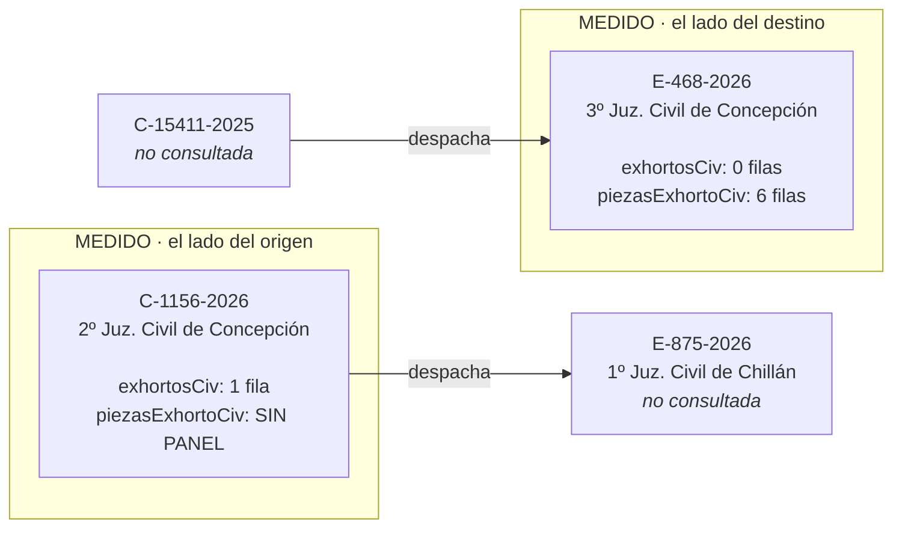

---
myst:
  html_meta:
    description: Qué se probó contra el sistema real, qué sólo contra respuestas guardadas y qué está mapeado sin ejecutar.
---

# Qué está verificado

Esta página existe para responder una sola pregunta, y es la que las dos audiencias de este
proyecto comparten: **¿este dato se puede afirmar?**

Distingue tres cosas que suelen confundirse: lo que se probó **contra el sistema real**, lo que
sólo se probó **contra respuestas guardadas**, y lo que está **mapeado en el código de la
plataforma pero nunca ejecutado**. Confundirlas es cómo un proyecto termina afirmando algo que
nadie midió.

Lo que se decidió hacer con esto, y en qué orden, está en la {doc}`hoja de ruta <roadmap>`.

## Contra qué se verificó cada cosa

Esta tabla es lo más importante de la página. Distingue tres cosas que suelen confundirse:
lo que se probó **contra el sistema real**, lo que sólo se probó **contra fixtures**, y lo que
está **mapeado en el código de la plataforma pero nunca ejecutado**.

### Verificado contra el sistema real

| Qué | Cómo se verificó |
|---|---|
| Búsqueda de causas en **laboral** | Una causa real, columnas confirmadas, con fixture propia |
| Búsqueda de causas en **cobranza** | Ídem, y publica RUC que civil no tiene |
| El detalle de cobranza existe y sus columnas son otras | `historiaCob`, `diligenciaCob`, `litigantesCob`, `deudaCob`, `liquidacionCob`. Trae `Estado Firma` y no trae `Foja` ni `Georref.` |
| Una búsqueda del buscador de fallos tarda 47,8 s, y hasta 177,0 s | Contra 4,3 s de la página del mismo host. Es Solr con facetas sobre más de un millón de documentos. Los 47,8 s eran una sola muestra, y tomarla por techo dejó el timeout en 90 s: con eso, tres citas que respondían en 81, 102 y 39 segundos se daban por perdidas |
| Búsqueda de causas en **suprema** y **Cortes de Apelaciones** | Las cuatro búsquedas de cada una. Lo que las bloqueaba era `radio-group`, el radio RIT/RUC del formulario, que las otras cuatro competencias toleran ausente |
| Qué exige cada competencia para acotar | `tribunal` en las cuatro de primera instancia, `corte` en apelaciones (avisa "Por favor seleccione una Corte"), nada en suprema |
| Buscador de fallos de Cortes de Apelaciones | Rol 1504-2019, tres sentencias. Dos consultas al mismo buscador tardaron 115,6 s y 177,0 s |
| Las cuatro capacidades nuevas, de punta a punta | 20 de agosto de 2026, **10 peticiones y todas 200**: 17 cortes, 24 tribunales en Concepción, el detalle de C-1156-2026 con su exhorto, y el documento del folio 9 (975.006 bytes, 1 página, sin capa de texto: un escaneo) |
| **La arista del exhorto, seguida entera** | El detalle dice que C-1156-2026 despachó E-875-2026 al 1º Juzgado Civil de Chillán; `listar_tribunales` sobre la corte 45 lo resuelve a **código 145**, que es con lo que se busca esa causa. Era el dato que faltaba |
| La georreferencia de una actuación | 20 de agosto de 2026, C-1156-2026: tres actuaciones georreferenciadas, y el modal devuelve coordenadas, precisión en metros y la fecha del dispositivo con hora. El parámetro es `valGeoRef` |
| El monitor de salas está en otro host y NO comparte cortafuegos | `salas.pjud.cl` responde `Server: Apache`, sin la cookie `TS<hex>` de F5 que sí traen la Oficina Judicial Virtual y el buscador de fallos |
| Los códigos de tribunal y de corte | Ver la sección propia más abajo |
| Buscador de fallos Laborales | 20 de agosto de 2026, texto libre: 106.068 sentencias visibles y las tres primeras con rol, caratulado, fecha y juzgado bien mapeados. Tardó **1,6 s**, o sea el techo de espera está dimensionado por Suprema y no por el resto |
| Códigos de cobranza | Competencia 6, tribunal `1332` (Jdo. de Cobranza Laboral y Previsional de Concepción), tipos de causa `A C D E J L P R` |
| Entrada pública sin Clave Única | `sesion-consultaunificada.php` → 200 |
| Derivación de prefijo de rutas y token | Tres sesiones distintas, token distinto en cada una |
| Búsqueda por RIT en civil | E-468-2026 y C-1156-2026 |
| Detalle de causa | Ambas causas |
| La lectura combinada del detalle | C-1156-2026 el 20 de agosto de 2026: 6 peticiones, todas 200, con los dos cuadernos, 23 actuaciones, 6 litigantes, cero notificaciones y el exhorto a Chillán. `liquidaciones` y `materias` llegaron en nulo, que es lo correcto: civil no publica esos paneles |
| Cuadernos múltiples | C-1156-2026: principal + apremio |
| Actuaciones de receptor con fecha doble | 8 actuaciones en E-468-2026, 6 en C-1156-2026 |
| Los cuatro tipos de diligencia documentados | Presentes en E-468-2026 |
| Georreferencia presente | Todas las actuaciones de ambas causas |
| El filtro de la plataforma es por User-Agent y no por huella TLS | Tres clientes, mismo handshake, distinto header |
| Búsqueda de jurisprudencia en Corte Suprema | `buscar_sentencias` respondió 200 con JSON de Solr |
| Verificación de una cita por rol y año | Rol y año existentes → exactamente una sentencia, con sala, fecha y enlace |
| El buscador de fallos entrega menos de lo que indexa | 300.005 visibles de 1.223.925 el 16 de agosto de 2026, medido sin filtros |
| Su reCAPTCHA no bloquea la búsqueda | Sesión anónima sin token → 200 con resultados reales |
| El tope real de filas por página es 250 | Se pidieron 250 y entregó 250, pese a que su configuración declara `10-20-50` |

### Verificado sólo contra fixtures

Funciona sobre HTML real guardado, pero **nunca se ejercitó contra el sistema en vivo**:

| Qué | Riesgo |
|---|---|
| Discrepancia entre las dos fuentes de fecha | Nunca se vio un caso real de discrepancia. La rama existe y está testeada con HTML sintético, pero no hay evidencia de cómo se ve en la práctica |
| Georreferencia ausente | Todas las actuaciones observadas la traen. No se sabe cómo se ve la celda cuando falta |
| Fecha imposible (31/02) | Defensa preventiva, nunca observada |
| Mensaje de "sin resultados" | Se copió de una respuesta real, pero el camino completo no se ejercitó |

### Mapeado pero nunca ejecutado

Las rutas se extrajeron del código de la plataforma y siguen sin ejecutarse. El cliente las
rechaza en vez de adivinar sus parámetros:

- El panel `diligenciaCob`, donde cobranza guarda de verdad sus diligencias
- `familia`, que la propia plataforma declara reservada y sólo entrega por Clave Única
- `detalleExhortos.php`, `causaOrigenCivil.php`, `geoReferenciaCivil.php`
- `anexoCausaCivil.php` y la descarga de documentos por `docuN.php`
- `receptorCivil.php`, que devuelve la tabla de **retiro** de documentos, no la de
  actuaciones. Se ejecutó una vez y se descartó por no ser lo que se buscaba

Las cuatro búsquedas (`consultaRit*`, `consultaNombre*`, `consultaJuridica*` y
`consultaFecha*`) salieron de esta lista: están verificadas en las seis competencias que el
servidor expone.

### Sin cubrir del todo

- **Causas reservadas.** No aparecen y no aparecerán.
- **Expiración de referencias.** Caducan a los 30 minutos. El flujo cabe holgado, pero no hay
  manejo explícito de expiración a mitad de cadena.

## Jurisprudencia: qué buscador está medido

### Los diez buscadores

Sólo el primero está verificado. **Cada buscador declara sus propios campos**, y esa es la
razón técnica de no exponer los otros todavía: Corte Suprema entrega `rol_era_sup_s`, mientras
Apelaciones usaría `rol_era_ape_s`. Un cliente que asuma los campos de Suprema devolvería
campos vacíos en vez de un error, que es exactamente el falso negativo que el proyecto evita.

El mecanismo ya no es el obstáculo: `juris.BUSCADORES` es una tabla que mapea nombre del
modelo a campo Solr, igual que `parser.COMPETENCIAS` para las causas, y `parse_sentencias`
recibe el buscador. Agregar uno es leer su `parametros_buscador` y llenar una fila.

Y hay una razón de uso para priorizar dos. Contadas el 17 de agosto de 2026 sobre las citas de
cuatro casos reales que el titular del proyecto aportó, 84 en total: **32 son de Cortes de
Apelaciones y de juzgados laborales**, o sea alrededor de un tercio de lo que alguien necesita
verificar cae fuera precisamente por estos dos buscadores. Rinden más que cualquier competencia
nueva de la Oficina Judicial Virtual.

Esa cuenta no lleva constante ni guardia en CI, a diferencia de las mediciones de la
plataforma, y la razón es que no es un dato de la plataforma: es el recuento de un conjunto
privado de documentos que el repositorio no contiene ni debe contener. Fijarlo en código
fingiría una verificabilidad que no existe. Lo que corresponde es lo que está escrito: la
fecha, el tamaño del conjunto y de dónde salió, para que quien lea sepa qué peso darle.

| Buscador | Estado |
|---|---|
| Corte Suprema | **Verificado.** `id_buscador` 528 |
| Corte de Apelaciones | **Verificado.** Rol 1504-2019, tres sentencias |
| Civiles | Mapeado, sin ejecutar |
| Laborales | **Verificado** el 20 de agosto de 2026: 106.068 sentencias visibles, y responde en **1,6 s** contra los 47,8 a 177,0 s de Suprema |
| Penales | Mapeado, sin ejecutar |
| Familia | Mapeado, sin ejecutar |
| Cobranza | Mapeado, sin ejecutar |
| Compendio Extranjería | Mapeado, sin ejecutar |
| Líneas Jurisprudenciales | Mapeado, sin ejecutar |
| Salud CS | Mapeado, sin ejecutar |

El identificador de cada buscador se deriva de su propia página, no se hardcodea. Verificar uno
nuevo es sobre todo comprobar qué campos declara su `parametros_buscador`.

### Endpoints del buscador, mapeados y sin ejecutar

| Ruta | Qué haría |
|---|---|
| `/busqueda/documentos` | Descargar el documento de la sentencia |
| `/busqueda/imprimir` | Versión imprimible |
| `/busqueda/arbol_json` | Índice temático: materias y submaterias |
| `/busqueda/listar_ids_relacionados` | Sentencias relacionadas con una dada |
| `/busqueda/get_suggester_results` | Sugerencias de términos |
| `/busqueda/busqueda_por_texto_autocompletable` | Autocompletado |
| `/busqueda/listar_georeferencia` | Georreferencia de la sentencia |
| `/detalle_sentencia/terminos_juridicos` | Glosario de términos |

Tres rutas más existen y **no se van a implementar**: `sentencias_guardadas` y `cambiar_clave`
escriben en una cuenta de usuario, y `mail_compartir_sentencia` envía correo desde la
infraestructura del Poder Judicial. Que el buscador sea de lectura no las vuelve inofensivas, y
el job de CI que verifica que no exista código de escritura busca esos tres nombres.

## Reglas de la plataforma ya mapeadas

Medidas probando combinaciones contra el sistema real. Se registran acá porque son la clase de
dato que se re-descubre a costa de peticiones si no queda escrito.

| Búsqueda | Obligatorio | Opcional | Aviso al faltar |
|---|---|---|---|
| Por rol | número, año | tipo, corte, tribunal | `Por favor ingresar Rol / Año para la búsqueda` |
| Por nombre | dos campos **de nombre**, tribunal | año, corte | `Por favor llene mínimo 2 campos` / `seleccione un Tribunal` |
| Por RUT jurídica | dígito verificador, tribunal | año, corte | `Por favor ingrese dígito verificador` |
| Por fecha | rango completo, tribunal | corte | `Por favor ingrese una Fecha Final` |

Dos cosas contraintuitivas:

- **Omitir el tribunal amplía los resultados.** La misma consulta por rol devolvió dos causas
  sin tribunal y una con él. Acotar de más esconde causas, que es el falso negativo que este
  proyecto existe para evitar.
- **El año no cuenta** para el mínimo de dos campos en la búsqueda por nombre.

Y una limitación de fondo: la búsqueda por nombre **exige tribunal**, así que no sirve para el
caso "sé el nombre pero no dónde está la causa", que era el que se suponía que resolvía.

## Sobre los identificadores de causa en esta documentación

Las fixtures van anonimizadas: sin nombres, sin RUT, sin los identificadores opacos de la
plataforma. Pero **los roles de causa que aparecen en los ejemplos siguen siendo
identificadores directos**: con un rol y un tribunal, una sola consulta devuelve el nombre
completo de las partes.

O sea la anonimización de las fixtures se deshace si se publica el rol al que corresponden.

Criterio adoptado:

- Los roles del caso propio del autor se conservan, porque el ejemplo trabajado es lo que hace
  entendible el proyecto y la decisión es suya.
- **Los roles de causas de terceros no se publican.** Una causa que aparece sólo porque se
  eligió para un sondeo no debe arrastrar a sus partes a un repositorio indexado.

Vale también para quien reporte un problema: la plantilla de issue pide el rol, y eso es
deliberado porque sin él no se puede reproducir. Quien reporte decide si su causa lo admite.

## Los códigos que las búsquedas exigen

No estaba mapeado porque los combos se llenan por AJAX, así que leer el HTML de
`consultaUnificada.php` no los muestra. Están en el JavaScript:

| Ruta | Método | Parámetros | Devuelve |
|---|---|---|---|
| `combosJSON/leeCorte.php` | POST | `tipoBusqueda` | Las cortes con su código |
| `combosJSON/leeTrib.php` | POST | `codCompetencia`, `codCorte`, `tipoBusqueda` | Los tribunales de esa corte con su código |

**Medido el 20 de agosto de 2026**: con competencia 3 y corte 46 responde JSON con 24
tribunales, cada uno `{"COD_TRIBUNAL": "163", "GLS_TRIBUNAL": "3º Juzgado Civil de
Concepción"}`. Las rutas cuelgan de la raíz del sitio y NO del prefijo `ADIR_`, que es lo
primero que se intentó y devuelve 404.

Con esto se cierra el único lugar donde este proyecto adivinó: el código 163 se dedujo porque
162 era el 2º Juzgado y salió bien, que es exactamente la forma de acertar que la regla de
"medir antes de exponer" existe para no aceptar. Ahora está medido.

## Los dos lados del exhorto

Parecía que `piezasExhortoCiv` faltaba a veces. No es eso: **el juego de paneles depende de si
la causa ES un exhorto**, y las dos mitades se ven desde causas distintas.

| Causa | `Proc.` | `exhortosCiv` | `piezasExhortoCiv` |
|---|---|---|---|
| C-1156-2026, 2º Juzgado Civil de Concepción (tribunal 162) | ordinaria | 1 fila | **sin panel** |
| E-468-2026, 3º Juzgado Civil de Concepción (tribunal 163) | `Exhorto` | 0 filas | **6 filas** |

Medido en vivo el 20 de agosto de 2026, cuatro peticiones. E-468-2026 es ella misma un
exhorto: su cabecera dice `Proc.: Exhorto`, `Etapa: 0 Exhorto`, y nombra a `C-15411-2025` como
causa de origen. Sus seis piezas son la tramitación que el tribunal de origen despachó junto
con el exhorto (`Ordena despachar mandamiento`, `Exhórtese`, `Curso progresivo a los autos`),
o sea **lo que el tribunal que recibe tuvo a la vista**.

**Son dos exhortos distintos, no los dos extremos de uno.** C-1156-2026 despacha E-875-2026,
que no se consultó; E-468-2026 tiene como origen a C-15411-2025, que tampoco. Lo que se midió
es un ejemplar de cada lado, y con eso alcanza para la conclusión: qué paneles trae depende de
si la causa ES un exhorto, no de cuál exhorto sea.

## Las rutas que entregan documentos

| Ruta | Parámetro | Qué entrega |
|---|---|---|
| `civil/documentos/docu.php` | `valorEncTxtDmda` | El texto de la demanda |
| `civil/documentos/docuN.php` | `dtaDoc` | El documento de una fila de la Historia |
| `civil/documentos/docuS.php` | `dtaDoc` | El documento de un escrito |
| `civil/documentos/newebookcivil.php` | `dtaEbook` | **El expediente entero en un PDF** |
| `civil/documentos/docCertificadoDemanda.php` | `dtaCert` | Certificado de envío de la demanda |
| `civil/documentos/docCertificadoEscrito.php` | `dtaCert` | Certificado de envío de un escrito |

Mapeadas leyendo la respuesta guardada de C-1156-2026. **Ninguna ejecutada**, así que vale la
regla de siempre: se mide antes de exponerla.

## Cómo se mapearon los endpoints

No hay sitemap, así que el mapeo de endpoints se hizo leyendo el JavaScript de
`consultaUnificada.php`, donde el sitio nombra 189 veces un `.php`, o sea 102 rutas distintas.
Ése es el método a repetir cuando la plataforma cambie, y las dos cifras salen de contarlas
sobre la fixture, no de recordarlas.
