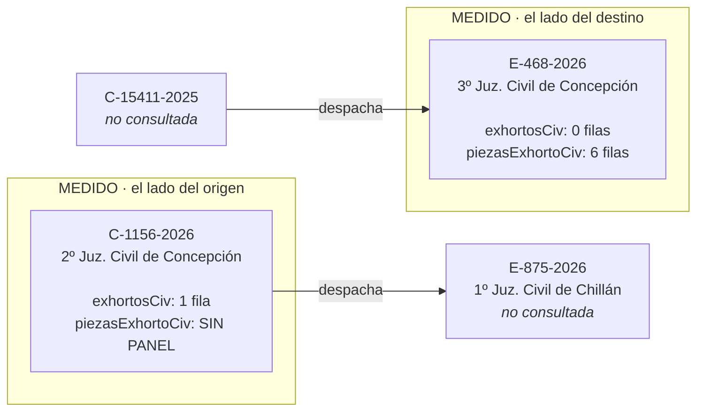

---
myst:
  html_meta:
    description: "Qué se probó contra el sistema real, qué sólo contra respuestas guardadas y qué está mapeado sin ejecutar."
---

# Qué está verificado

Esta página existe para responder una sola pregunta, y es la que las dos audiencias de este
proyecto comparten: **¿este dato se puede afirmar?**

Distingue tres cosas que suelen confundirse: lo que se probó **contra el sistema real**, lo que
sólo se probó **contra respuestas guardadas**, y lo que está **mapeado en el código de la
plataforma pero nunca ejecutado**. Confundirlas es cómo un proyecto termina afirmando algo que
nadie midió.

Lo que se decidió hacer con esto, y en qué orden, está en la {doc}`hoja de ruta <roadmap>`.

## Contra qué se verificó cada cosa

### Verificado contra el sistema real

| Qué | Cómo se verificó |
|---|---|
| Búsqueda de causas en **laboral** | Una causa real, columnas confirmadas, con fixture propia |
| Búsqueda de causas en **cobranza** | Ídem, y publica RUC que civil no tiene |
| El detalle de cobranza existe y sus columnas son otras | `historiaCob`, `diligenciaCob`, `litigantesCob`, `deudaCob`, `liquidacionCob`. Trae `Estado Firma` y no trae `Foja` ni `Georref.` |
| Una búsqueda del buscador de fallos tarda 47,8 s, y hasta 177,0 s | Contra 4,3 s de la página del mismo host. Es Solr con facetas sobre más de un millón de documentos. Los 47,8 s eran una sola muestra, y tomarla por techo dejó el timeout en 90 s: con eso, tres citas que respondían en 81, 102 y 39 segundos se daban por perdidas |
| Búsqueda de causas en **suprema** y **Cortes de Apelaciones** | Las cuatro búsquedas de cada una. Lo que las bloqueaba era `radio-group`, el radio RIT/RUC del formulario, que las otras cuatro competencias toleran ausente |
| Qué exige cada competencia para acotar | `tribunal` en las cuatro de primera instancia, `corte` en apelaciones (avisa "Por favor seleccione una Corte"), nada en suprema |
| Buscador de fallos de Cortes de Apelaciones | Rol 1504-2019, tres sentencias. Dos consultas al mismo buscador tardaron 115,6 s y 177,0 s |
| Las cuatro capacidades nuevas, de punta a punta | 20 de agosto de 2026, **10 peticiones y todas 200**: 17 cortes, 24 tribunales en Concepción, el detalle de C-1156-2026 con su exhorto, y el documento del folio 9 (975.006 bytes, 1 página, sin capa de texto: un escaneo) |
| La arista del exhorto, **resuelta y no recorrida** | El detalle dice que C-1156-2026 despachó E-875-2026 al 1º Juzgado Civil de Chillán, y `listar_tribunales` sobre la corte 45 lo resuelve a código 145. Con eso la búsqueda es posible, pero **E-875-2026 no se consultó**: lo medido es que el dato que faltaba ya está, no que la causa de destino responda |
| La georreferencia de una actuación | Ver la sección propia más abajo |
| La paginación del buscador de fallos | 22 de agosto de 2026: desplazamientos 0, 10 y 250 sobre 59.819 visibles, tres páginas sin una sola sentencia repetida. Más allá del final: 200 con la lista vacía |
| El detalle de las causas penales | Se abre por `unificado`, no por `penal`. Ver la sección propia más abajo |
| El panel de anexos de un escrito, en laboral | Ver la sección propia más abajo |
| El monitor de salas está en otro host y NO comparte cortafuegos | `salas.pjud.cl` responde `Server: Apache`, sin la cookie `TS<hex>` de F5 que sí traen la Oficina Judicial Virtual y el buscador de fallos |
| Los códigos de tribunal y de corte | Ver la sección propia más abajo |
| Buscador de fallos Laborales | 20 de agosto de 2026, texto libre: 106.068 sentencias visibles y las tres primeras con rol, caratulado, fecha y juzgado bien mapeados. Tardó **1,6 s**, o sea el techo de espera está dimensionado por Suprema y no por el resto |
| Códigos de cobranza | Competencia 6, tribunal `1332` (Jdo. de Cobranza Laboral y Previsional de Concepción), tipos de causa `A C D E J L P R` |
| Entrada pública sin Clave Única | `sesion-consultaunificada.php` → 200 |
| Derivación de prefijo de rutas y token | Tres sesiones distintas, token distinto en cada una |
| Búsqueda por RIT en civil | E-468-2026 y C-1156-2026 |
| Detalle de causa | Ambas causas |
| La lectura combinada del detalle | C-1156-2026 el 20 de agosto de 2026: 6 peticiones, todas 200, con los dos cuadernos, 23 actuaciones, 6 litigantes, cero notificaciones y el exhorto a Chillán. `liquidaciones` y `materias` llegaron en nulo, que es lo correcto: civil no publica esos paneles |
| Cuadernos múltiples | C-1156-2026: principal + apremio |
| Actuaciones de receptor con fecha doble | 8 actuaciones en E-468-2026, 6 en C-1156-2026 |
| Los cuatro tipos de diligencia documentados | Presentes en E-468-2026 |
| Georreferencia presente | Todas las actuaciones de ambas causas |
| El filtro de la plataforma es por User-Agent y no por huella TLS | Tres clientes, mismo handshake, distinto header |
| Búsqueda de jurisprudencia en Corte Suprema | `buscar_sentencias` respondió 200 con JSON de Solr |
| Verificación de una cita por rol y año | Rol y año existentes → exactamente una sentencia, con sala, fecha y enlace |
| El buscador de fallos entrega menos de lo que indexa | 300.005 visibles de 1.223.925 el 16 de agosto de 2026, medido sin filtros |
| Su reCAPTCHA no bloquea la búsqueda | Sesión anónima sin token → 200 con resultados reales |
| El tope real de filas por página es 250 | Se pidieron 250 y entregó 250, pese a que su configuración declara `10-20-50` |

### Verificado sólo contra fixtures

Funciona sobre HTML real guardado, pero **nunca se ejercitó contra el sistema en vivo**:

| Qué | Riesgo |
|---|---|
| Discrepancia entre las dos fuentes de fecha | Nunca se vio un caso real de discrepancia. La rama existe y está testeada con HTML sintético, pero no hay evidencia de cómo se ve en la práctica |
| Georreferencia ausente | Todas las actuaciones observadas la traen. No se sabe cómo se ve la celda cuando falta |
| Fecha imposible (31/02) | Defensa preventiva, nunca observada |
| Mensaje de "sin resultados" | Se copió de una respuesta real, pero el camino completo no se ejercitó |

### Los audios de audiencia existen, y la ruta no es la que parece

Medido el 22 de agosto de 2026 sobre una causa laboral real, con consulta anónima y sin
credenciales. **Rompe el supuesto de que todo lo descargable de la plataforma es PDF.**

| | |
|---|---|
| Ruta | `POST /audio/listadoAudio.php`, **fuera** del prefijo `ADIR_nnn` |
| Parámetro | `dtaAudio`, con la referencia que la cabecera del detalle entrega en `listadoAudioLaboral(...)` |
| Respuesta | 200, `text/html`, 25.854 bytes |
| Filas | 11, con columnas `Nro`, `Descargar`, `Audio`, `Fecha` y `Referencia` |
| Descarga | `audio/audioByPass.php?action=download&x=<token>`, un enlace por fila |
| `Fecha` | viene **vacía** en las once, aunque la columna existe |

La `Referencia` es el nombre del archivo `.mp3`, y describe el tramo de la audiencia:
inicio, relación de los hechos, llamado a conciliación, hechos a probar, cada parte
ofreciendo prueba, cierre. O sea el audio está troceado por acto procesal y no en una pista
única.

:::{warning}
**La ruta equivocada devuelve 200 con la tabla vacía.**

Primero se pidió `laboral/modal/listadoAudioLaboral.php`, construida por analogía con los
otros modales del sitio, que sí viven bajo `{competencia}/modal/`. La plataforma respondió
**200**, con `text/html`, con el modal correcto y su encabezado "Listado Archivos de
Audio"... y `<tbody></tbody>`.

Una tabla vacía se lee como "esta causa no tiene audios". Es exactamente el falso negativo
que la regla 4 existe para evitar, producido acá por el instrumento de medición y no por la
plataforma: de haberlo dado por bueno, la conclusión escrita habría sido que el canal no
entrega nada de forma anónima.

Lo que lo destapó fue leer el JavaScript del sitio en vez de seguir suponiendo:
`listadoAudioLaboral(val)` hace `POST` a `../audio/listadoAudio.php`, que no está bajo el
prefijo de sesión.
:::

**Se expone el listado y NO el archivo**, y las dos preguntas que faltaban siguen sin medir a
propósito: cuánto pesa un archivo y si `audioByPass.php` entrega el MP3 a una consulta anónima.
Ninguna hace falta para entregar el enlace, y bajar un audio de audiencia es traer a disco la
voz de personas que son parte en un juicio.

Es también lo que sirve: una transcripción automática no reemplaza oír la audiencia, y no
siempre se puede transcribir. `listar_audios_audiencia` dice qué hay, de qué tramo es cada
archivo y con qué enlace se baja.

### Mapeado pero nunca ejecutado

Las rutas se extrajeron del código de la plataforma y siguen sin ejecutarse. El cliente las
rechaza en vez de adivinar sus parámetros:

- `familia`, que la propia plataforma declara reservada y sólo entrega por Clave Única
- `detalleExhortos.php`, `causaOrigenCivil.php`, `geoReferenciaCivil.php`
- `anexoCausaCivil.php`
- **11 de las 18 rutas de anexo** que el JavaScript del sitio nombra, repartidas en las seis
  competencias. Siete se midieron; ver la sección propia más abajo. Donde no hay ruta medida,
  la actuación declara `tiene_anexo` con la ruta en nulo y ahí termina lo que se puede hacer
- `expedienteApe` (la pestaña "Expediente Primera Instancia" del detalle de apelaciones) y
  `IncompetenciaApe`. De los **6** paneles que apelaciones publica se leen **2**
- `receptorCivil.php`, que devuelve la tabla de **retiro** de documentos, no la de
  actuaciones. Se ejecutó una vez y se descartó por no ser lo que se buscaba

Las cuatro búsquedas (`consultaRit*`, `consultaNombre*`, `consultaJuridica*` y
`consultaFecha*`) salieron de esta lista: están verificadas en las seis competencias que el
servidor expone.

### Los paneles de los que nunca se vio una fila

Se abrieron **sesenta y una causas** el 22 de agosto de 2026, en cinco barridos y sobre cinco
competencias, buscando una fila en cada uno de estos cinco paneles. Ninguno la trajo.

| Panel | Competencia | Qué es | Causas abiertas sin verlo |
|---|---|---|---|
| `EscPendLab` | laboral | "Escritos Pendientes", el equivalente de `escritosCiv` | 28 |
| `liquidacionLab` | laboral | Liquidación, con RUT, nombre y monto | 28 |
| `agregadosSup` | suprema | Causas que se ven junto con ésta | 22, siempre presente y siempre vacío |
| `ExhortosApe` | apelaciones | Exhortos de la corte | 10, y en la mitad el panel **ni siquiera existe** |
| `IncompetenciaApe` | apelaciones | Declaraciones de incompetencia | ídem |

**Los tres primeros se leen igual, con las columnas del encabezado.** El sitio las publica en la
tabla vacía, así que el orden y la cantidad SÍ están medidos y la validación posicional protege
como en cualquier otro panel. Lo que no está medido es qué trae cada celda: si una publica un
formulario donde acá se lee texto, ese campo llegará vacío en vez de fallar. `parser.py` los
nombra en `SIN_FILAS_OBSERVADAS`, y hay un guardia que compara esa lista contra las fixtures en
las dos direcciones.

Se leen porque el día que una causa los traiga la respuesta va a incluirlos, en vez de
descartarlos en silencio. El mapeo se comprueba metiendo una fila sintética en el panel real,
que es lo único comprobable sin una causa que lo llene.

**Los dos de apelaciones NO se mapean, y es distinto**: ahí no hay qué mapear. Su tabla trae dos
columnas, la primera en blanco y la segunda con el rótulo (`Exhorto`, `Incompetencia`), y en la
mitad de los detalles el `id` ni siquiera aparece, así que tampoco se sabe si el panel existe
para esa clase de causa.

Buscarlos al azar ya se agotó: los paneles de cola sólo se llenan mientras algo está pendiente,
y los de una etapa sólo en las causas que llegaron a esa etapa. La forma barata de conseguir una
fila es que aparezca en una consulta real.

### Sin cubrir del todo

- **Causas reservadas.** No aparecen y no aparecerán.
- **Expiración de referencias.** Caducan a los 30 minutos. El flujo cabe holgado, pero no hay
  manejo explícito de expiración a mitad de cadena.

## Penal se lee, y no por la ruta que lleva su nombre

Medido el 22 de agosto de 2026. Penal era la única competencia con cero paneles leídos, y la
razón resultó no ser la que se suponía: **sus causas no se abren por `penal/`**.

Cada fila del listado de penal llama a `detalleCausaPenalUnificado`, que hace POST a
`unificado/modal/causaUnificado.php`. En el listado que se revisó fila por fila, **las cinco**
la llaman; ninguna usa la ruta de `penal/`.

Y responde: **nueve** causas abiertas así, de 2024 y de 2026, todas con 200, y las que se
miraron panel por panel traían filas reales, con la cabecera llena. Consulta anónima, como el
resto del sitio.

:::{warning}
**Pedirle el detalle a `penal/modal/causaPenal.php` responde 200 con una carcasa vacía.**

Es la ruta que el nombre de la competencia sugiere, y fue la primera que se probó. Devolvió
seis mil bytes con los cuatro paneles, sus encabezados completos... y cero filas en todos, con
la cabecera en blanco: `RIT : --`, `RUC :`, `Caratulado:`.

Leído sin desconfianza, eso dice "esta causa penal no tiene ninguna actuación, ninguna parte y
ninguna notificación". Es el mismo falso negativo que ya había aparecido con el listado de
audios y con los anexos, y por tercera vez lo produjo el instrumento y no la plataforma.

Lo que lo destapó fue leer el `onclick` de la fila en vez de suponer por el nombre.
:::

Lo que publica el detalle de penal, con los encabezados tal como los emite:

| Panel | Columnas |
|---|---|
| `historia` | Folio · Doc. · Anexo · Trámite · Desc. Trámite · Fec. Trámite · **Fec. Firma** · Estado |
| `litigantes` | Participantes · Persona · Nombre o Razón Social |
| `notificaciones` | Tipo Notificación · Estado Notificación · Fecha Notificación · Nombre · Estampado · Geo |
| `relaciones` | Nombre · Materia · Estado Causa · Fecha Cambio Estado |

Tres cosas para quien lo implemente, y ninguna se puede deducir de las otras competencias:

**Los `id` de los paneles son genéricos.** `historia`, `litigantes`, `notificaciones`: sin
sufijo de competencia, al revés que `historiaCiv`, `movimientoLab` o `notificacionCob`. Un
mapeo que busque por `id` en la respuesta equivocada va a encontrar algo igual.

**Los litigantes NO traen RUT.** Las otras cinco competencias lo publican y acá la columna no
existe: hay `Participantes`, `Persona` y `Nombre o Razón Social`. Un modelo compartido con las
demás informaría el RUT en vacío, que se lee como "el sitio no lo tiene para esta persona".

**`relaciones` no existe en ninguna otra.** Y su primera versión, la que devuelve
`penal/modal/causaPenal.php`, publica `Nombre · Delito · Estado Relación · Fecha Cambio
Estado`: la palabra `Delito` aparece ahí y no en la que sirve. Son dos tablas distintas con el
mismo nombre.

**Y no se implementa: decidido el 22 de agosto de 2026, después de medir.** El detalle de penal
queda fuera de alcance. No por falta de datos, que están acá arriba, sino porque el criterio que
sostiene al resto del proyecto, devolver lo que la plataforma publica sin identificarse, no se
traslada solo a un expediente que nombra imputados y víctimas.

Penal sigue siendo buscable, que es lo que ya estaba: rol, tribunal, RUC, caratulado y estado.
Lo que no se expone es el contenido de la causa.

Sobre el reCAPTCHA, para que no se repita la conclusión equivocada: el JavaScript del sitio
adjunta un token a las **seis** rutas de detalle, incluida la de civil, que este proyecto lee
sin ninguno desde el principio. O sea el token que aparece en el código no es lo que impide
leer penal, y decir que penal está "detrás de un captcha" sería afirmar de más.

## Jurisprudencia: qué buscador está medido

### Los diez buscadores

Tres de los diez están verificados, y la tabla de abajo dice cuáles. **Cada buscador declara
sus propios campos**, y esa es la
razón técnica de no exponer los otros todavía: Corte Suprema entrega `rol_era_sup_s`, mientras
Apelaciones usaría `rol_era_ape_s`. Un cliente que asuma los campos de Suprema devolvería
campos vacíos en vez de un error, que es exactamente el falso negativo que el proyecto evita.

El mecanismo ya no es el obstáculo: `juris.BUSCADORES` es una tabla que mapea nombre del
modelo a campo Solr, igual que `parser.COMPETENCIAS` para las causas, y `parse_sentencias`
recibe el buscador. Agregar uno es leer su `parametros_buscador` y llenar una fila.

Y hay una razón de uso para priorizar dos. Contadas el 17 de agosto de 2026 sobre las citas de
cuatro casos reales que el titular del proyecto aportó, 84 en total: **32 son de Cortes de
Apelaciones y de juzgados laborales**, o sea alrededor de un tercio de lo que alguien necesita
verificar cae fuera precisamente por estos dos buscadores. Rinden más que cualquier competencia
nueva de la Oficina Judicial Virtual.

Esa cuenta no lleva constante ni guardia en CI, a diferencia de las mediciones de la
plataforma, y la razón es que no es un dato de la plataforma: es el recuento de un conjunto
privado de documentos que el repositorio no contiene ni debe contener. Fijarlo en código
fingiría una verificabilidad que no existe. Lo que corresponde es lo que está escrito: la
fecha, el tamaño del conjunto y de dónde salió, para que quien lea sepa qué peso darle.

| Buscador | Estado |
|---|---|
| Corte Suprema | **Verificado.** `id_buscador` 528 |
| Corte de Apelaciones | **Verificado.** Rol 1504-2019, tres sentencias. `id_buscador` 168 |
| Civiles | Mapeado, sin ejecutar |
| Laborales | **Verificado** el 20 de agosto de 2026: 106.068 sentencias visibles, y responde en **1,6 s** contra los 47,8 a 177,0 s de Suprema. `id_buscador` 271 |
| Penales | Mapeado, sin ejecutar |
| Familia | Mapeado, sin ejecutar |
| Cobranza | Mapeado, sin ejecutar |
| Compendio Extranjería | Mapeado, sin ejecutar |
| Líneas Jurisprudenciales | Mapeado, sin ejecutar |
| Salud CS | Mapeado, sin ejecutar |

El identificador de cada buscador se deriva de su propia página, no se hardcodea. Verificar uno
nuevo es sobre todo comprobar qué campos declara su `parametros_buscador`.

### Endpoints del buscador, mapeados y sin ejecutar

| Ruta | Qué haría |
|---|---|
| `/busqueda/documentos` | Descargar el documento de la sentencia |
| `/busqueda/imprimir` | Versión imprimible |
| `/busqueda/arbol_json` | Índice temático: materias y submaterias |
| `/busqueda/listar_ids_relacionados` | Sentencias relacionadas con una dada |
| `/busqueda/get_suggester_results` | Sugerencias de términos |
| `/busqueda/busqueda_por_texto_autocompletable` | Autocompletado |
| `/busqueda/listar_georeferencia` | Georreferencia de la sentencia |
| `/detalle_sentencia/terminos_juridicos` | Glosario de términos |

Tres rutas más existen y **no se van a implementar**: `sentencias_guardadas` y `cambiar_clave`
escriben en una cuenta de usuario, y `mail_compartir_sentencia` envía correo desde la
infraestructura del Poder Judicial. Que el buscador sea de lectura no las vuelve inofensivas, y
el job de CI que verifica que no exista código de escritura busca esos tres nombres.

## Reglas de la plataforma ya mapeadas

Medidas probando combinaciones contra el sistema real. Se registran acá porque son la clase de
dato que se re-descubre a costa de peticiones si no queda escrito.

| Búsqueda | Obligatorio | Opcional | Aviso al faltar |
|---|---|---|---|
| Por rol | número, año | tipo, corte, tribunal | `Por favor ingresar Rol / Año para la búsqueda` |
| Por nombre | dos campos **de nombre**, tribunal | año, corte | `Por favor llene mínimo 2 campos` / `seleccione un Tribunal` |
| Por RUT jurídica | dígito verificador, tribunal | año, corte | `Por favor ingrese dígito verificador` |
| Por fecha | rango completo, tribunal | corte | `Por favor ingrese una Fecha Final` |

Dos cosas contraintuitivas:

- **Omitir el tribunal amplía los resultados.** La misma consulta por rol devolvió dos causas
  sin tribunal y una con él. Acotar de más esconde causas, que es el falso negativo que este
  proyecto existe para evitar.
- **El año no cuenta** para el mínimo de dos campos en la búsqueda por nombre.

Y una limitación de fondo: la búsqueda por nombre **exige tribunal**, así que no sirve para el
caso "sé el nombre pero no dónde está la causa", que era el que se suponía que resolvía.

## Sobre los identificadores de causa en esta documentación

Las fixtures van anonimizadas: sin nombres, sin RUT, sin los identificadores opacos de la
plataforma. Pero **los roles de causa que aparecen en los ejemplos siguen siendo
identificadores directos**: con un rol y un tribunal, una sola consulta devuelve el nombre
completo de las partes.

O sea la anonimización de las fixtures se deshace si se publica el rol al que corresponden.

Criterio adoptado:

- Los roles del caso propio del autor se conservan, porque el ejemplo trabajado es lo que hace
  entendible el proyecto y la decisión es suya.
- **Los roles de causas de terceros no se publican.** Una causa que aparece sólo porque se
  eligió para un sondeo no debe arrastrar a sus partes a un repositorio indexado.

Vale también para quien reporte un problema: la plantilla de issue pide el rol, y eso es
deliberado porque sin él no se puede reproducir. Quien reporte decide si su causa lo admite.

## Los códigos que las búsquedas exigen

No estaba mapeado porque los combos se llenan por AJAX, así que leer el HTML de
`consultaUnificada.php` no los muestra. Están en el JavaScript:

| Ruta | Método | Parámetros | Devuelve |
|---|---|---|---|
| `combosJSON/leeCorte.php` | POST | `tipoBusqueda` | Las cortes con su código |
| `combosJSON/leeTrib.php` | POST | `codCompetencia`, `codCorte`, `tipoBusqueda` | Los tribunales de esa corte con su código |

**Medido el 20 de agosto de 2026**: con competencia 3 y corte 46 responde JSON con 24
tribunales, cada uno `{"COD_TRIBUNAL": "163", "GLS_TRIBUNAL": "3º Juzgado Civil de
Concepción"}`. Las rutas cuelgan de la raíz del sitio y NO del prefijo `ADIR_`, que es lo
primero que se intentó y devuelve 404.

Con esto se cierra el único lugar donde este proyecto adivinó: el código 163 se dedujo porque
162 era el 2º Juzgado y salió bien, que es exactamente la forma de acertar que la regla de
"medir antes de exponer" existe para no aceptar. Ahora está medido.

## Los dos lados del exhorto

Parecía que `piezasExhortoCiv` faltaba a veces. No es eso: **el juego de paneles depende de si
la causa ES un exhorto**, y las dos mitades se ven desde causas distintas.

| Causa | `Proc.` | `exhortosCiv` | `piezasExhortoCiv` |
|---|---|---|---|
| C-1156-2026, 2º Juzgado Civil de Concepción (tribunal 162) | ordinaria | 1 fila | **sin panel** |
| E-468-2026, 3º Juzgado Civil de Concepción (tribunal 163) | `Exhorto` | 0 filas | **6 filas** |

Medido en vivo el 20 de agosto de 2026, cuatro peticiones. E-468-2026 es ella misma un
exhorto: su cabecera dice `Proc.: Exhorto`, `Etapa: 0 Exhorto`, y nombra a `C-15411-2025` como
causa de origen. Sus seis piezas son la tramitación que el tribunal de origen despachó junto
con el exhorto (`Ordena despachar mandamiento`, `Exhórtese`, `Curso progresivo a los autos`),
o sea **lo que el tribunal que recibe tuvo a la vista**.

**Son dos exhortos distintos, no los dos extremos de uno.** C-1156-2026 despacha E-875-2026,
que no se consultó; E-468-2026 tiene como origen a C-15411-2025, que tampoco. Lo que se midió
es un ejemplar de cada lado, y con eso alcanza para la conclusión: qué paneles trae depende de
si la causa ES un exhorto, no de cuál exhorto sea.

## Las rutas que entregan documentos

| Ruta | Parámetro | Qué entrega |
|---|---|---|
| `civil/documentos/docu.php` | `valorEncTxtDmda` | El texto de la demanda |
| `civil/documentos/docuN.php` | `dtaDoc` | El escrito. El sitio titula el enlace "Documento principal del escrito" |
| `civil/documentos/docuS.php` | `dtaDoc` | La resolución. El sitio titula el enlace "Descargar Documento" |
| `civil/documentos/newebookcivil.php` | `dtaEbook` | **El expediente entero en un PDF** |
| `civil/documentos/docCertificadoDemanda.php` | `dtaCert` | Certificado de envío de la demanda |
| `civil/documentos/docCertificadoEscrito.php` | `dtaCert` | Certificado de envío de un escrito |

Mapeadas leyendo la respuesta guardada de C-1156-2026. De las seis, **sólo `docuN.php` se
ejecutó** (folio 9 de esa causa, 975.006 bytes, un escaneo de una página); las otras cinco
siguen sin ejecutarse, así que vale la
regla de siempre: se mide antes de exponerla.

Y no son sólo las de civil. `obtener_documento` acepta la ruta que la actuación entrega, así
que la tabla que decide qué es una ruta válida cubre las cinco competencias con detalle
mapeado. Todas salen del `action` de un formulario de la respuesta, y **ninguna de las
veintisiete se ha ejecutado salvo `docuN.php`**:

| Competencia | Rutas |
|---|---|
| `civil` | las seis de arriba, más `anexoDocCivil.php` (`dtaDoc`), que entregan los dos paneles de anexo |
| `cobranza` | `docuCobranza.php`, `docDemandaCobranza.php` (`valorDocDmda`), `docLiquidacionCobranza.php` (`valorLiq`), `docOficioCobranza.php` (`dtaDocOf`), `newebookcobranza.php` (`dtaEbook`), `docCertificadoEscrito.php` (`dtaCert`) |
| `laboral` | `docAnexoLaboral.php` (`dtaDoc`), `docDiligenciaIdaLaboral.php` (`dtaDocIda`), `docDiligenciaVueltaLaboral.php` (`dtaDocVta`), `docReformadoLaboral.php` (`valorRef`), `docReformadoEscritoLaboral.php` (`valorRefEsc`), `newebooklaboral.php`, `docCertificadoDemanda.php`, `docCertificadoEscrito.php` |
| `apelaciones` | `anexoDocRecursoApelaciones.php` (`dtaDoc`), `docCausaApelaciones.php` (`valorDoc`), `newebookapelaciones.php` |
| `suprema` | `docEscritosSuprema.php` (`dtaDoc`), `docCausaSuprema.php` (`valorFile`), `newebooksuprema.php` |

El parámetro cambia por ruta y no por competencia, y por eso se lee del formulario en vez de
deducirlo: `docuN.php` usa `dtaDoc` y `docReformadoLaboral.php` usa `valorRef`, en la misma
columna de la misma tabla.

## Cómo se mapearon los endpoints

No hay sitemap, así que el mapeo de endpoints se hizo leyendo el JavaScript de
`consultaUnificada.php`, donde el sitio nombra 189 veces un `.php`, o sea 102 rutas distintas.
Ése es el método a repetir cuando la plataforma cambie, y las dos cifras salen de contarlas
sobre la fixture, no de recordarlas.

## El segundo canal de documentos: los anexos del escrito

Medidos el 22 de agosto de 2026 contra causas reales, uno por uno. Cada panel es una petición
POST bajo `{competencia}/modal/`, con la referencia que la propia celda de la Historia lleva en
su `onclick`.

| Panel | Parámetro | Columnas | Descarga |
|---|---|---|---|
| `anexoCausaCivil.php` | `dtaAnexCau` | Doc. · Fecha · Referencia | `anexoDocCivil.php` (`dtaDoc`) |
| `anexoCausaSolicitudCivil.php` | `dtaCausaAnex` | Doc. · Fecha · Referencia | `anexoDocCivil.php` (`dtaDoc`) |
| `anexoCausaSolEscritoCivil.php` | `dtaCausaAnexSol` | Doc. · Fecha · Referencia | `anexoDocCivil.php` (`dtaDoc`) |
| `anexoEscritoLaboral.php` | `dtaAnex` | Doc. · **Folio** · Fecha · Referencia | `docAnexoLaboral.php` (`dtaDoc`) |
| `anexoRecursoApelaciones.php` | `dtaAnexRec` | **Doc. Principal** · Doc. · Fecha · Referencia | `anexoDocRecursoApelaciones.php` (`dtaDoc`) |
| `escritoSuprema.php` | `dtEsc` | Doc. · Doc. Físico · Tipo Documento · Cantidad · Observación del Documento · Docto. Físico | `docEscritosSuprema.php` (`dtaDoc`) |
| `anexoDemandaUnificado.php` | `dtaAnex` | Doc. · Fecha · Referencia · Tipo | `unificado/documentos/docu.php` (`data`) |
| `anexoEscritoUnificado.php` | `dtaAnex` | Folio · Documento · Trámite · Fecha Firma | `unificado/documentos/docu.php` (`data`) |

**Los ocho no comparten forma, y ése es el hallazgo.** No son la misma tabla con los
encabezados traducidos: civil no publica folio, apelaciones antepone el documento principal del
recurso, y suprema publica seis columnas que hablan de otra cosa (cuántos ejemplares hay y si
el ejemplar físico se exige). Leer uno con el mapa de otro no da error: corre los campos y deja
la fecha en la celda de la descarga.

**Cuatro de los ocho se midieron y no se exponen**, y la razón es siempre la misma: no hay de
dónde sacar su referencia. Ofrecerlos sería una herramienta cuyo parámetro nadie puede
conseguir.

| Panel | Dónde vive su referencia |
|---|---|
| `anexoCausaCivil.php` | En la cabecera, bajo "Anexos de la causa": es del expediente, no de un escrito |
| `anexoRecursoApelaciones.php` | En el panel `recursoApe`, que es otro panel del detalle y no está mapeado |
| `anexoDemandaUnificado.php` | En el detalle de las causas penales, que se abre por `unificado` y no está mapeado |
| `anexoEscritoUnificado.php` | ídem |

Los dos de `unificado` apuntan además a una ruta de descarga distinta de todas las demás, con
el campo `data` en vez de `dtaDoc`.

Los cuatro que sí se ofrecen son los que una fila entrega en `anexo_ruta`: tres desde la celda
`Anexo` de un folio de la Historia, y el de `anexoCausaSolEscritoCivil.php` desde la de un
escrito por resolver. La medición de ese último salió de ahí: el panel de escritos lo ofrecía y
nadie lo había mirado.

**Lo que hacía invisible esta falta es que el folio SÍ entregaba un documento.** Las dos filas
con anexo del cuaderno de apremio de C-1156-2026 son escritos que traen su `docuN.php`: quien
pidiera el documento del folio recibía un PDF real y quedaba creyendo que tenía el folio
completo. Un documento entregado tapa mejor lo que falta que una fila en blanco.

**Las doce que faltan se rechazan a propósito.** Cada una nombra su ruta y su parámetro
distinto, y armarlas por analogía no da un error: da una página que no es la que se pidió. Está
medido en este mismo canal, al buscar el listado de audios de audiencia por la ruta análoga a
la de otro modal: respondió **200 con la tabla vacía**, o sea con la forma exacta de "este
folio no tiene anexos". Por eso `parse_anexos` levanta cuando la tabla viene sin filas.

No es que no se hayan intentado: se abrieron **dieciocho** causas buscándolas, nueve de
cobranza y nueve penales, de 2024 y de 2026, y **ninguna ofrecía** ninguno de los doce que
faltan. Lo que falta para medirlos no es tiempo de red sino una causa que los traiga.

**La descarga en sí no se ejecutó.** Las rutas de la última columna se leyeron del formulario
de cada fila, igual que las cinco rutas civiles de la tabla de más arriba que siguen sin
ejecutarse. Lo medido es el panel que las nombra.

## Qué devuelve la georreferencia

Medido el 20 de agosto de 2026, y de nuevo al implementarlo: la tercera fecha **coincidió con
`fecha_diligencia`** en las tres actuaciones contrastadas, que es lo que la vuelve útil como
fuente independiente.

Medido el 20 de agosto de 2026 sobre C-1156-2026: **seis** actuaciones georreferenciadas
entre los dos cuadernos, tres en cada uno, consultadas las seis.

| Dato | Forma |
|---|---|
| Coordenadas | Latitud y longitud con siete decimales. **No se transcriben acá**: ver abajo |
| Precisión | En metros, con decimales. Medidas en una sola causa: 6,0 · 10,04 · 26,68 · 56,22 y **103,13** |
| Fecha del dispositivo | Con hora. Medidas: `31-03-2026 10:34` y `30-03-2026 10:31` |
| Intentos | Un entero. Medido: 1 |

**Una de las seis no trae georreferencia**, y el panel lo dice con todas sus letras: *"No
existen Georreferencia para mostrar"*. O sea el icono de la Historia significa que el sitio
OFRECE preguntar, no que haya respuesta, y confirmarlo cuesta una petición por actuación. El
contrato de `georreferenciado` se corrigió por esto.

**La fecha del dispositivo es el hallazgo.** Este proyecto existe por la distinción entre la
fecha de registro y la de diligencia. Ésta es una TERCERA fuente, la del aparato del ministro
de fe, y es la única que trae **hora** en todo el proyecto: una fuente independiente con la que
contrastar la que corre los plazos.

Las coordenadas no se copian acá, y eso no es pudor: siete decimales sitúan un punto con
precisión de centímetros, o sea el domicilio de una persona que es parte en un juicio, y
versionarlo sería persistir un dato de terceros en el repositorio. Entregarlo por el protocolo
es otra cosa, y es lo que este proyecto ya hace con el RUT.

Hay seis rutas, una por competencia más una unificada, bajo `ADIR_nnn/<competencia>/modal/`. El
parámetro es `valGeoRef` y la referencia viaja en el `onclick` de la celda, igual que la de los
documentos y con el mismo tipo de token firmado.
